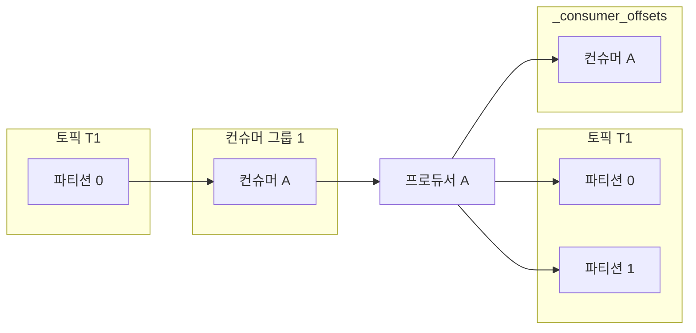

# 8.1 멱등적 프로듀서

- 동일한 작업을 여러 번 실행해도 한 번 실행한 것과 결과가 같은 서비스를 멱등적(Idempotence)이라고 함

```java
UPDATE t SET x=x+1 where y=5 -> 멱등적X
UPDATE t SET x=18 where y=5 멱등적O
```

- 최소 한 번으로 프로듀서를 설정한다면 프로듀서에서 메시지 재전송으로 인해 메시지가 최소 한 번 이상 도착할 수 있는 불확실성이 존재
    - 즉, 메시지 중복이 발생
- 다음과 같은 경우 중복 메시지가 발생
    1. 파티션 리더가 프로듀서로부터 레코드를 받아 팔로워들에게 복제 성공
    2. 프로듀서에게 응답을 보내기 전 리더 파티션의 브로커에 크래시
    3. 프로듀서 입장에서는 응답을 받지 못해 타임아웃이 발생하고, 메시지 재전송
    4. 재전송된 메시지가 새 리더에 도착하지만, 해당 메시지는 이미 저장된 상태
        1. 중복 발생 상황
- 카프카의 멱등적 프로듀서 기능은 자동으로 이런 중복을 탐지하고 처리
    - 위 상황에 경우엔 `enable.idenpotence=true` 로 설정하면 중복 메시지를 방지할 수 있음

## 8.1.1 멱등적 프로듀서의 작동 원리

- `enable.idenpotence=true` 로 설정하면 메시지는 고유한 프로듀서ID와 시퀀스 넘버를 가짐
    
    - 대상 토픽 + 파티션 + 프로듀서ID + 시퀀스 넘버 = 메시지의 고유한 식별자
- 각 브로커는 해당 브로커에 할당된 모든 파티션들에 쓰여진 마지막 5개의 메시지들을 추적하기 위해 고유 식별자를 사용
    
    - 파티션별로 추적되어야 하는 시퀀스 넘버의 수를 제한하고 싶다면 프로듀서의 `max.in.flights.requests.per.connection` 이 5이하로 잡혀있어야 함
    - 여기서 말하는 메시지는 batch/request에 해당
        - 즉 배치에 담긴 여러개의 메시지를 추적
- 브로커가 받은 적 있는 메시지일 경우 적절한 에러를 발생하여 중복 메시지를 거부
    
    - 에러는 프로듀서에 로깅도 되고 지표에 반영되지만, 예외 발생은 아니기 때문에 사용자에게 경보를 보내진 않음
- 만약 브로커가 예상보다 높은 시퀀스 넘버를 받게 된다면?
    
    - 브로커는 2번 메시지 다음에 3번이 올 것을 예상하지만, 27번 메시지가 오면 어떻게 될까?
    - 이런 경우 브로커는 `out of order sequence number` 에러를 발생
    - 트랜잭션 기능 없이 멱등적 프로듀서만 사용할 경우 이 에러는 무시해도 좋음
    
    <aside>
    
    - `out of order sequence number` 에러 발생 후 프로듀서가 정상 작동한다면, 이 에러는 보통 프로듀서와 브로커 사이에 메시지 유실이 있었음을 의미
    - 브로커가 2번 뒤에 27번을 받았다면 3~26번 메시지까지 뭔가가 일어난 것
    - 만약 로그에 이러한 에러가 찍힌다면, 프로듀서와 브로커 설정을 재점검하고 프로듀서 설정이 고신뢰성을 위해 권장되는 값으로 잡혀 있는지, 아니면 언클린 리더 선출이 발생했는지 여부를 확인해 볼 필요가 있음 </aside>
- 작동이 실패했을 경우 멱등적 프로듀서가 어떻게 처리하는지를 생각해보자
    

### 1. 프로듀서 재시작

- 프로듀서에 장애가 발생하면 보통 새 프로듀서를 생성해서 장애가 난 프로듀서를 대체
    - 사람이 직접 재시작하거나, 쿠버네티스 같은 자동 장애 복구 기능이 동작
- 프로듀서가 시작될 때 멱등적 프로듀서 기능이 켜져 있을 경우, 프로듀서는 초기화 과정에서 카프카 브로커에게 프로듀서ID를 생성 받음
    - 트랜잭션 기능을 켜지 않았을 경우에 초기화할 때마다 새로운 ID가 생성
    - 즉, 프로듀서 장애 이후 새로운 프로듀서가 이전 프로듀서가 전송한 메시지를 재전송하면 브로커에서 중복 메시지를 알아차리지 못함
    - 기존 프로듀서가 멈췄다가 새 프로듀서가 투입된 뒤 작동을 재개해도 마찬가지
- 서로 다른 ID를 가진 서로 다른 프로듀서로 간주되어 기존 프로듀서는 좀비로 취급되지 않음

### 2. 브로커 장애

- 브로커 장애가 발생할 경우 컨트롤러는 장애가 난 브로커가 리더를 맡고 있었던 파티션들에 대해 새 리더를 선출
- 토픽 A의 파티션0에 메시지를 쓰는 프로듀서를 갖고 있다고 가정
    - 이 파티션의 리더 레플리카는 브로커5에 있고, 팔로워 레플리카는 브로커3에 있음
    - 브로커5에 장애 발생 시 브로커3이 새로운 리더로 선출
    - 프로듀서는 메터데이터 프로토콜을 통해 브로커3이 새 리더임을 알아차리고 거기로 메시지를 쓰기 시작
- 브로커3 입장에서 어느 시퀀스 넘버까지 쓰여졌는지 어떻게 알고 중복 메시지를 걸러내는가?
- 리더는 새 메시지가 쓰여질 때마다 인메모리 프로듀서 상태에 저장된 최근 5개의 시퀀스 넘버를 업데이트
    - 즉, 팔로워가 리더가 된 시점에는 이미 메모리 안에 최근 5개의 시퀀스 넘버를 가지고 있는 것
    - 따라서 새로 쓰여진 메시지의 유효성 검증이 재개될 수 있는 것
- 여기서 예전 리더가 다시 돌아온다면 어떤 일이 벌어질까?
    - 재시작 후에는 인메모리 프로듀서 상태는 메모리에 저장되어 있지 않음
    - 복구 과정에 도움이 될 수 있도록, 브로커는 종료되거나 새 세그먼트가 생성될 때마다 프로듀서 상태에 대한 스냅샷을 파일 형태로 저장
    - 프로커가 시작되면 파일에서 최신 상태를 읽어 옴
    - 그러고 현재 리더로부터 복제한 레코드를 사용해 프로듀서 상태를 업데이트하여 최신 상태를 복구
    - 그래서 이 브로커가 다시 리더가 될 준비가 될 시점엔 최신 시퀀스 넘버를 갖고 있게 됨
- 만약 브로커가 크래시 나서 최신 스냅샷이 업데이트되지 않는다면?
    - 프로듀서ID, 시퀀스 넘버는 카프카 로그에 저장되는 메시지 형식의 일부
    - 크래시 복구 작업이 진행되는 동안 프로듀서 상태는 더 오래 된 스냅샷뿐만 아니라 각 파티션 최신 세그먼트의 메시지들 역기 사용해서 복구
    - 복구 작업이 완료되는 대로 새로운 스냅샷 파일이 저장
- 만약 메시지가 없다면 어떻게 될까?
    - 보존 기한은 2시간인데 지난 두 시간동안 메시지가 하나도 들어오지 않은 상태
    - 메시지가 없다면 중복이 없다는 얘기가 됨
    - 이 경우 즉시 새 메시지를 받기 시작해서 새로 들어오는 메시지들을 기준으로 프로듀서 상태를 생성할 수 있음

## 8.1.2 멱등적 프로듀서의 한계

- 카프카의 멱등적 프로듀서는 프로듀서의 내부 로직으로 인한 재시도가 발생할 경우 생기는 중복만 방지
- 동일한 메시지를 `send()` 를 두 번 호출하면 멱등적 프로듀서가 개입하지 않아 중복 메시지가 생성
    - 프로듀서 에외를 잡아 애플리케이션이 직접 재시도하는 것보다 프로듀서에 탑재된 재시도 매커니즘을 사용하는 것이 더 나음
- 여러 인스턴스를 띄우거나 하나의 인스턴스에서 여러 개의 프로듀서를 띄우는 애플리케이션들 역시 흔함
    - 이러한 프로듀서 중 두 개가 동일한 메시지를 전송하려고 시도할 경우, 멱등적 프로듀서는 이를 잡아내지 못함
    - 파일 디렉토리와 같은 원본에서 데이터를 읽어서 카프카로 쓰는 애플리케이션에서 꽤 흔하게 발생

<aside>

멱등적 프로듀서는 프로듀서 자체의 재시도 메커니즘(프로듀서, 네트워크, 브로커 에러로 인해 발생하는)에 의한 중복만을 방지

</aside>

## 8.1.3 멱등적 프로듀서 사용법

- `enable.idempotence=true` 로 설정하면 됨
- 프로듀서에 `acks=all` 설정이 잡혀있다면, 성능에는 차이가 없을 것임
- 멱등적 프로듀서 기능을 활성화시키면 다음과 같은 것들이 바뀜
    - 프로듀서ID를 받아오기 위해 프로듀서 시동 과정에서 API를 하나 더 호출
    - 전송되는 각각의 레코드 배치에는 프로듀서ID와 배치 내 첫 메시지 시퀀스 넘버가 포함. 이 새 필드들은 각 메시지 매치에 96비트를 추가한다. 따라서 대부분의 경우 작업 부하에 어떠한 오버헤드도 되지 않음
        - 레코드 배치에서 각 메시지의 시퀀스 넘버는 첫 메시지 시퀀스 넘버에 변화량을 더하면 나옴
        - 프로듀서ID는 long 타입, 시퀀스 넘버는 integer 타입
    - 브로커들은 모든 프로듀서 인스턴스에서 들어온 레코드 배치의 시퀀스 넘버를 검증해서 메시지 중복을 방지
    - 장애가 발생하더라도 각 파티션에 쓰여지는 메시지들의 순서 보장. `max.in.flight.requests.per.connection` 설정이 1보다 큰 값으로 잡혀도 마찬가지
        - 5는 기본값인 동시에 멱등적 프로듀서가 지원하는 가장 큰 값

---

# 8.2 트랜잭션

- 트랜잭션 기능은 카프카 스트림즈 애플리케이션의 정합성을 보장하기 위해 도입
    - 스트림 처리 애플리케이션이 정확한 결과를 산출하도록 하기 위해 입력 레코드는 정확히 한 번 처리되어야 하고, 처리 결과도 정확히 한 번만 반영되어야 함
    - 트랜잭션 기능은 스트림 애플리케이션이 정확한 결과를 산출할 수 있도록 함
- 트랜잭션 기능이 스트림 애플리케이션을 위해 특별히 개발되었음을 염두할 필요가 있음
    - 스트림 처리 애플리케이션의 기본 패턴인 ‘읽기-처리-쓰기’ 패턴에서 사용하도록 개발됨
    - 트랜잭션은 이런 맥락에서 ‘정확히 한 번’ 의미 구조를 보장할 수 있는 것
    - 입력 레코드의 처리는 애플리케이션의 내부 상태가 업데이트되고 결과가 출력 토픽에 성공적으로 쓰여졌을 때에야 완료된 것으로 간주

<aside>

- 트랜잭션은 근본적인 메커니즘의 이름이고, ‘정확히 한 번’ 의미 구조, ‘정확히 한 번’ 보장은 스트림 처리 애플리케이션의 작동을 가리킴
- 카프카 스트림즈는 정확히 한 번 보장을 구현하기 위해 트랜잭션 기능 사용
- 스파크 스트리밍, 플링크 같은 스트림 프레임워크도 정확히 한 번을 위해 다른 메커니즘을 사용 </aside>

## 8.2.1 트랜잭션 활용 사례

- 트랜잭션은 정확성이 중요한 스트림 처리 애플리케이션에 큰 도움이 됨
    - 스트림 처리 로직에 집적이나 조인이 포함되어 있는 경우 특히 도움이됨
- 스트림 애플리케이션에서 다수의 레코드를 집적해 하나로 만들 경우에 몇 개의 입력 레코드가 한 번 이상 처리되었을 수 있기 때문에 결과 레코드가 잘못되었는지 확인하는 것이 훨씬 어려움
- 금융 애플리케이션은 ‘정확히 한 번’ 기능이 정확한 집적 결과를 보장하는 데 쓰이는 복잡한 스트림 처리 애플리케이션의 전형적인 예

## 8.2.2 트랜잭션이 해결하는 문제

- 스트림 처리 애플리케이션은 원본 토픽에서 이벤트를 읽고, 처리 한 다음, 결과를 다른 토픽에 씀
- 정확히 한 번만 쓰여지도록 하고 싶을 때 무엇이 잘못될 수 있을까?

### 1. 애플리케이션 크래시로 인한 재처리

- 애플리케이션은 메시지를 읽어서 처리한 뒤 두 가지를 해야함
    
    1. 결과를 출력 토픽에 쓰기
    2. 읽어 온 메시지의 오프셋을 커밋
    
    - 이 두 작업이 순서대로 실행되었다고 가정
    - 출력 토픽에는 썼지만 입력 오프셋 커밋 전 애플리케이션 크래시가 발생하면?
- 컨슈머가 크래시가 나면 몇 초가 지난 후 하트비트가 끊어지면서 리밸런스가 발생하고, 컨슈머가 읽던 파티션은 다른 컨슈머로 재할당될 것임
- 컨슈머는 새로 할당된 파티션의 마지막 커밋된 오프셋부터 레코드를 읽어오기 시작
    - 즉, 마지막으로 커밋된 오프셋에서부터 크래시가 난 시점까지 다시 처리될 것이며 결과가 출력 토픽에 다시 쓰여질 것임 → 중복이 발생

### 2. 좀비 애플리케이션에 의해 발생하는 재처리

- 애플리케이션이 카프카에서 레코드 배치를 읽어온 후 뭔가를 하기 전 멈추거나, 카프카로 연결이 끊어진다면 어떻게 될까?
- 하트비트가 끊어지면서 해당 컨슈머에 할당된 파티션이 다른 컨슈머에게 재할당될 것임
- 재할당 받은 컨슈머가 레코드 배치를 다시 읽어서 처리하고 결과를 출력 토픽에 쓰기 작업을 계속 함
    - 그 사이 멈췄던 애플리케이션이 다시 작동할 수 있음
    - 즉, 마지막으로 읽어 왔던 레코드 배치를 처리하고 결과를 출력 토픽에 쓰게 됨
    - 자신이 죽은 것으로 판정되어 다른 인스턴스들이 현재 해당 파티션을 할당받은 상태라는 걸 알아차릴 때까지 이 작업을 계속 할 수 있음
- 스스로 죽은 상태인지 모르는 컨슈머를 좀비라 부르고, 추가적인 보장이 없을 경우, 좀비가 출력 토픽에 데이터를 쓰면서 중복된 결과가 발생할 수 있음

## 8.2.3 트랜잭션은 어떻게 ‘정확히 한 번’을 보장하는가?

- 스트림 처리 애플리케이션은 읽기, 처리, 쓰기를 수행하고, ‘정확히 한 번’ 처리는 이것이 원자적으로 이루어진다는 의미
    - 부분적인 결과(오프셋 커밋 성공, 결과 쓰기 실패)가 결코 발생하지 않을 거라는 보장이 필요
- 카프카 트랜잭션은 원자적 다수 파티션 쓰기 기능을 도입함
    - 이 아이디어는 오프셋을 커밋하는 것과 결과를 쓰는 것은 둘 다 파티션에 메시지를 쓰는 과정을 수반한다는 점에서 착안한 것
- 만약 트랜잭션을 시작해서 양쪽에 메시지를 쓰고, 둘 다 성공해서 커밋할 수 있다면 그 다음부터는 ‘정확히 한 번’ 의미 구조가 알아서 해 줌



- 트랜잭션을 사용해서 원자적 다수 파티션 쓰기를 수행하려면 트랜잭션 프로듀서를 사용해야 함
    
    - 보통의 프로듀서와의 차이점은 `transactional.id` 설정이 잡혀있고 `initTransactions()` 을 호출해서 초기화해주었다는 것임
    - `transactional.id` 는 재시작을 하더라도 값이 유지되고, 브로커에 의해 자동으로 생성되는 `producer.id` 와 달리 프로듀서 설정의 일부임
    - `transactional.id` 의 주 용도는 재시작 후 동일한 프로듀서를 식별하는 것
    - `transactional.id` 와 `producer.id` 가 대응 관계를 유지하다가 이미 있는 `transactional.id` 프로듀서가 `initTransactions()` 를 다시 호출하면 이전에 쓰던 `producer.id` 값을 할당
- 좀비 인스턴스가 중복 프로듀서를 생성하는 것을 방지하려면 좀비 펜싱(zobie pencing) 혹은 좀비 인스턴스가 출력 스트림에 결과를 쓰는 것을 방지해야 함
    
    - 일반적인 방법은 에포크를 사용하는 것
    - 카프카는 트랜잭션적 프로듀서가 `initTransactions()` 를 호출하면 `transactional.id` 에 해당하는 에포크 값을 증가시킴
    - 같은 `transactional.id` 를 가지고 있지만 에포크 값은 낮은 프로듀서가 메시지 전송, 트랜잭션 커밋, 트랜잭션 중단 요청을 보낼 경우 `FencedProducer` 에러가 발생하면서 거부
    - 오래된 프로듀서는 `close()` 를 호출해서 닫아주게 됨
    - 즉, 좀비가 중복 레코드를 쓰는 것은 불가능
- 카프카 2.5 이후부터 트랜잭션 메타데이터에 컨슈머 그룹 메타데이터를 추가할 수 있는 옵션이 생김
    
    - 이 메타데이터는 펜싱에 사용되기 때문에 좀비를 펜싱하면서 서로 다른 트랜잭션ID를 갖는 프로듀서들이 같은 파티션들에 레코드를 쓸 수 있게 됨
- 트랜잭션은 대부분 프로듀서 쪽 기능
    
    - 트랜잭션 프로듀서 생성, 트랜잭션 시작, 다수의 파티션에 레코드 쓰기, 처리된 레코드의 오프셋 쓰기, 트랜잭션 커밋 및 중단과 같은 모든 작업이 프로듀서로부터 이루어짐
- 컨슈머에 올바른 격리 수준이 설정되어 있지 않을 경우 ‘정확히 한 번’ 보장은 이루어지지 않을 것임
    
- `isolation.level` 설정값을 잡아줌으로써 트랜잭션 기능을 써서 쓰여진 메시지들을 읽어오는 방식을 제어할 수 있음
    
    - `read_committed` 일 경우 토픽들은 구독한 뒤 `poll()` 을 호출하면 커밋된 트랜잭션에 속한 메시지나 트랜잭션에 속하지 않는 메시지만 리턴(중단된 트랜잭션, 진행중인 트랜잭션에 속한 메시지는 리턴되지 않음)
    - `read_uncommitted` 로 두면 진행중이거나 중단된 트랜잭션에 속한 모든 레코드가 리턴
    - `read_committed` 로 설정해도 특정 트랜잭션에 속한 모든 메시지가 리턴된다고 보장되는 것도 아님
    - 트랜잭션에 속한 토픽의 일부만 구독했기 때문에 일부 메시지만 리턴받을 수 있는 것임
- 메시지 읽기 순서를 보장하기 위해 `read_committed` 모드에서는 진행중인 트랜잭션이 처음으로 시작된 시점(Last Stable Offset, LSO) 이후에 쓰여진 메시지는 리턴되지 않음
    
    - 이 메시지들은 트랜잭션이 프로듀서에 의해 커밋되거나 중단될 때까지, `transaction.timeout.ms` 만큼 시간이 지나 브로커가 트랜잭션을 중단시킬 때까지 보류됨
    - 트랜잭션이 오랫동안 닫히지 않고 있으면 컨슈머들이 지체되면서 종단 지연이 길어짐
    
    <aside>
    
    `read_committed` 로 동작하는 컨슈머는 `read_uncommitted` 로 동작하는 컨슈머보다 약간 뒤에 있는 메시지를 읽게 된다.
    
    </aside>
    
- 스트림 처리 애플리케이션은 입력 토픽이 트랜잭션 없이 쓰여졌을 경우에도 ‘정확히 한 번’ 출력을 보장
    
- 원자적 다수 파티션 쓰기 기능은 만약 출력 레코드가 출력 토픽에 커밋되었을 경우, 입력 레코드의 오프셋 역시 해당 컨슈머에 대해 커밋되는 것을 보장
    
    - 결과적으로 입력 레코드는 다시 처리되지 않음

## 8.2.4 트랜잭션으로 해결할 수 없는 문제들

- ‘정확히 한 번 보장’이 카프카에 대한 쓰기 이외의 작동에서는 보장되지 않음
- 컨슈머가 항상 전체 트랜잭션을 읽어 온다고 (트랜잭션 간의 경계에 대해 알고 있다고) 가정하면 안됨
- 다음은 카프카의 트랜잭션 기능이 ‘정확히 한 번’ 보장에 도움이 되지 않는 몇 가지 경우

### 1. 스트림 처리에 있어서의 부수 효과

- 스트림 처리 애플리케이션의 처리 단계에서 이메일을 보내는 작업은 ‘정확히 한 번’ 의미 구조를 활성화한다고 해서 이메일이 한 번만 발송되는 것은 아님
    - 이 기능은 카프카에 쓰여지는 레코드에만 적용됨
- 레코드 중복을 방지하기 위해 시퀀스 넘버를 사용하는 것이나 트랜잭션을 중단 혹은 취소하기 위해 마커를 사용하는 것은 카프카 안에서만 작동하는 것이지, 이메일 발송을 취소시킬 수 있는 것은 아님
- 이는 스트림 처리 애플리케이션 안에서 외부 효과를 일으키는 REST API 호출, 파일 쓰기에도 해당

### 2. 카프카 토픽에서 읽어서 데이터베이스에 쓰는 경우

- 이 경우 애플리케이션은 외부 데이터베이스에 결과물을 쓰고, 프로듀서가 사용되지 않음
- 레코드는 JDBC와 같은 데이터베이스 드라이버를 통해 데이터베이스에 쓰여지고, 오프셋은 컨슈머에 의해 카프카에 커밋
- 하나의 트랜잭션에서 외부 데이터베이스에는 결과를 쓰고 카프카에 오프셋을 커밋할 수 있도록 해주는 메커니즘은 없음
    - 대신 4장에서 설명한 것과 같이 오프셋을 데이터베이스에 저장하도록 할 수 있고, 이렇게 하면 하나의 트랜잭션에서 데이터와 오프셋을 동시에 데이터베이스에 커밋할 수 있음
    - 이 경우에 데이터베이스의 트랜잭션 보장에 달렸음

### 3. 데이터베이스에서 읽어서, 카프카에 쓰고, 여기서 다시 다른 데이터베이스에 쓰는 경우

- 카프카 트랜잭션은 하나의 앱에서 데이터베이스 데이터를 읽고, 트랜잭션을 구분하고, 카프카에 레코드를 쓰고, 다른 데이터베이스에 레코드를 쓰고, 원본 데이터베이스의 원래 트랜잭션을 관리하는 종단 보장에 필요한 기능을 가지고 있지 않음
- 하나의 트랜잭션 안에서 레코드와 오프셋을 함께 커밋하는 문제 외에도 또 다른 문제가 있기 때문
- 카프카 컨슈머의 `read_committed` 보장은 데이터베이스 트랜잭션을 보존하기엔 너무 약함
    - 컨슈머가 아직 커밋되지 않은 레코드를 볼 수 없는 것은 사실이지만, 일부 토픽에서 랙이 발생했을 수 있는 만큼 이미 커밋된 트랜잭션의 레코드를 모두 봤을 거라는 보장 또한 없음
- 트랜잭션의 경계를 알 수 있는 방법이 없어서 언제 트랜잭션이 시작되었고, 끝났는지, 레코드 중 어느 정도를 읽었는지도 알 수 없음

<aside>

즉, kafka 트랜잭션은 내부에 메시지를 쓰는 작업은 강력하게 보장할 수 있지만, DB 레벨의 작업까지 보장해주진 않는다.

</aside>

### 4. 한 클러스터에서 다른 클러스터로 데이터 복제

- 하나의 클러스터에서 다른 클러스터로 데이터를 복사할 때 정확히 한 번을 보장할 수 있음
    - 상세한 내용은 미러메이커 2.0 정확히 한 번 기능(KIP-656)에서 확인 가능
- 하지만 이것이 트랜잭션의 원자성을 보장하지는 않음
- 만약 애플리케이션이 여러 개의 레코드와 오프셋을 트랜잭션적으로 쓰고, 미러메이커2.0이 이 레코드들을 다른 카프카 클러스터에 복사한다면, 복사 과정에서 트랜잭션 속성이나 보장 같은 것은 유실
    - 이 정보들은 카프카의 데이터를 관계형 데이터베이스에 복사할 때도 유실
- 컨슈머 입장에서는 트랜잭션의 모든 데이터를 읽어왔는지 알 수 없고 보장할 수도 없는 것
    - 토픽의 일부만 구독했을 경우 전체 트랜잭션의 일부만 복사할 수 있음

<aside>

소스 클러스터에서는 a, b, c가 하나의 트랜잭션으로 묶여서 처리되기 때문에 컨슈머는 커밋되어야 이 세 메시지를 확인할 수 있다. 하지만 미러메이커가 타겟 클러스터로 복제할 때는 이 트랜잭션 경계까지 복제하지 않는다. 그래서 a, b, c 복제 타이밍에 따라서 타겟 클러스터에서는 커밋되지 않은 메시지를 읽을 수 있게 된다.

</aside>

### 5. 발행/구독 패턴

- 발행/구독 패턴에 트랜잭션을 사용할 경우 몇 가지 보장되는 것이 있기는 함
- 즉, `read_committed` 모드가 설정된 컨슈머들은 중단된 트랜잭션에 속한 레코드들을 보지 못할 것임
- 하지만 이러한 보장은 ‘정확히 한 번’에 미치지 못함
- 오프셋 커밋 로직에 따라 컨슈머들은 메시지를 한 번 이상 처리할 수 있음
- 이 경우 카프카가 보장하는 것은 JMS 트랜잭션에서 보장하는 것과 비슷하지만, 커밋되지 않은 트랜잭션들이 보이지 않도록 컨슈머들에 `read_committed` 설정이 되어 있어야 한다는 조건이 붙음
- JMS 브로커들은 모든 컨슈머에게 커밋되지 않은 트랜잭션의 레코드를 주지 않음

<aside>

메시지를 쓰고 나서 커밋하기 전 다른 애플리케이션이 응답하기를 기다리는 패턴은 반드시 피해야 한다. 다른 애플리케이션은 트랜잭션이 커밋될 때까지 메시지를 받지 못하기 때문에 결과적으로 데드락이 발생한다.

</aside>

## 8.2.5 트랜잭션 사용법

- 트랜잭션은 브로커 기능이기도 하며, 카프카 프로토콜의 일부인 만큼 여러 클라이언트들이 트랜잭션을 지원
- 트랜잭션을 사용하는 일반적이고 권장되는 방법은 카프카 스트림즈에서 exactly-once 보장을 활성화 하는 것임
    - 이렇게 하면 트랜잭션 기능을 직접 사용하진 않지만, 카프카 스트림즈가 대신 해당 기능을 사용해 필요로 하는 보장을 제공
- 카프카 스트림즈 애플리케이션에서 ‘정확히 한 번’ 보장 기능을 활성화하려면 `processing.guarantee` 설정을 `exactly_once` 나 `exactly_once_beta` 로 잡아 주면 됨
- 카프카 스트림즈를 사용하지 않고 ‘정확히 한 번’ 보장을 사용하고 싶다면?
    - 트랜잭션 API를 직접 사용함
    - 프로듀서에 `transactional.id` 를 설정해 다수의 파티션에 원자적 쓰기가 가능한 트랜잭션적 프로듀서를 생성
    - 트랜잭션의 일부가 되는 컨슈머는 오프셋을 직접 커밋하지 않고, 프로듀서가 트랜잭션 과정의 일부로서 오프셋을 씀. (컨슈머의 오프셋 커밋 기능을 꺼야 함)

```java
Properties producerProps = new Properties();
producerProps.put(ProducerConfig.BOOTSTRAP_SERVERS_CONFIG, "localhost:9092");
producerProps.put(ProducerConfig.CLIENT_ID_CONFIG, "DemoProducer");
producerProps.put(ProducerConfig.TRANSACTIONAL_ID_CONFIG, transactionalId);

producer = new KafkaProducer<>(producerProps);

Properties consumerProps = new Properties();
consumerProps.put(ConsumerConfig.BOOTSTRAP_SERVERS_CONFIG, "localhost:9092");
consumerProps.put(ConsumerConfig.GROUP_ID_CONFIG, groupId);
consumerProps.put(ConsumerConfig.ENABLE_AUTO_COMMIT_CONFIG, "false");
consumerProps.put(ConsumerConfig.ISOLATION_LEVEL_CONFIG, "read_committed");

consumer = new KafkaConsumer<>(consumerProps);

producer.initTransactions();

consumer.subscribe(Collections.singleton(inputTopic));

while (true) {
    try {
        ConsumerRecords<Integer, String> records =
            consumer.poll(Duration.ofMillis(200));

        if (records.count() > 0) {
            producer.beginTransaction();

            for (ConsumerRecord<Integer, String> record : records) {
                ProducerRecord<Integer, String> customizedRecord =
                    transform(record);
                producer.send(customizedRecord);
            }

            Map<TopicPartition, OffsetAndMetadata> offsets = consumerOffsets();
            producer.sendOffsetsToTransaction(offsets, consumer.groupMetadata());
            producer.commitTransaction();
        }
    } catch (ProducerFencedException | InvalidProducerEpochException e) {
        throw new KafkaException(String.format(
            "The transactional.id %s is used by another process", transactionalId));
    } catch (KafkaException e) {
        producer.abortTransaction();
        resetToLastCommittedPositions(consumer);
    }
}
```

1. 프로듀서에 `transactional.id`를 설정해 트랜잭션 프로듀서를 생성한다. 트랜잭션 ID는 고유해야 하며 오랫동안 유지되어야 한다. 본질적으로 애플리케이션 인스턴스를 정의하는 값이다.
2. 트랜잭션의 일부가 되는 컨슈머는 오프셋을 직접 커밋하지 않는다. 프로듀서가 트랜잭션 과정의 일부로 오프셋을 쓰므로, 컨슈머의 자동 커밋 기능은 꺼야 한다.
3. 이 예제에서는 컨슈머가 입력 토픽을 읽어온다. 입력 토픽의 레코드도 트랜잭션 프로듀서에 의해 쓰였다고 가정한다. 진행 중이거나 실패한 트랜잭션을 무시하고 커밋된 트랜잭션만 읽기 위해 컨슈머 격리 수준을 `read_committed`로 설정한다. 단, 컨슈머는 커밋된 트랜잭션 외에도 비트랜잭션 쓰기 레코드는 여전히 읽을 수 있다.
4. 트랜잭션 프로듀서를 사용할 때 가장 먼저 해야 하는 일은 `initTransactions()` 호출이다. 이 메서드는 트랜잭션 ID를 등록하고, 같은 트랜잭션 ID를 가진 다른 프로듀서들이 좀비로 인식될 수 있도록 에포크 값을 증가시킨다. 같은 트랜잭션 ID를 사용하는 아직 진행 중인 트랜잭션도 중단된다.
5. 여기서는 `subscribe()` 컨슈머 API를 사용한다. 애플리케이션 인스턴스에 할당된 파티션은 리밸런스 결과에 따라 변경될 수 있다. KIP-447 이전에는 동일한 파티션에 같은 트랜잭션 ID를 안정적으로 매핑해야 했기 때문에 트랜잭션 펜싱이 더 어려웠다. KIP-447 이후에는 트랜잭션에 컨슈머 그룹 정보를 추가해 좀비 펜싱을 수행할 수 있다. 관련 파티션이 할당 해제될 때마다 트랜잭션을 커밋하는 것이 좋다.
6. 레코드를 읽어 왔고, 처리해서 결과를 생성한다. `beginTransaction()` 호출 이후부터 트랜잭션이 종료될 때까지 쓰이는 모든 레코드는 하나의 원자적 트랜잭션 일부가 된다.
7. 레코드를 처리하는 부분이다. 즉, 모든 비즈니스 로직이 여기 들어간다.
8. 트랜잭션 작업 중에는 오프셋을 커밋하는 것이 중요하다. 결과 쓰기에 실패하더라도 처리되지 않은 레코드의 오프셋이 커밋되지 않도록 보장하기 위해서다. 자동 커밋은 꺼야 하며, 컨슈머의 커밋 API도 직접 호출하면 안 된다. 다른 방식으로 오프셋을 커밋하면 트랜잭션 보장이 적용되지 않는다.
9. 필요한 메시지를 모두 쓰고 오프셋도 트랜잭션에 포함했으므로 `commitTransaction()`을 호출해 작업을 마무리한다. 이 메서드가 성공적으로 리턴하면 전체 트랜잭션이 완료된 것이다. 이후 다음 이벤트 배치를 읽어와 처리할 수 있다.
10. `ProducerFencedException` 또는 `InvalidProducerEpochException`이 발생하면 현재 프로듀서가 좀비가 된 것이다. 애플리케이션이 처리를 멈췄거나 연결이 끊긴 사이, 같은 트랜잭션 ID를 가진 새 인스턴스가 실행되었을 가능성이 높다. 현재 트랜잭션은 이미 중단되었고 다른 인스턴스가 대신 처리하고 있을 수 있으므로 곱게 종료하는 것 외에는 할 일이 없다.
11. 트랜잭션 처리 중 일반적인 `KafkaException`이 발생하면 트랜잭션을 중단하고, 컨슈머 위치를 마지막으로 커밋된 위치로 되돌린 뒤 재시도한다.

## 핵심 요약

- `transactional.id`는 트랜잭션 프로듀서의 논리적 인스턴스를 식별하며, 좀비 프로듀서 펜싱에 사용된다.
- 트랜잭션에 포함되는 컨슈머는 `enable.auto.commit=false`로 설정해야 한다.
- `read_committed`를 사용하면 커밋된 트랜잭션의 레코드만 읽고, 진행 중이거나 중단된 트랜잭션의 레코드는 무시한다.
- 처리 결과 쓰기와 오프셋 커밋은 같은 트랜잭션 안에 포함해야 한다.
- 트랜잭션 처리 중에는 `consumer.commitSync()`나 `consumer.commitAsync()`를 직접 호출하면 안 된다.
- `commitTransaction()`이 성공하면 결과 레코드 쓰기와 오프셋 커밋이 함께 확정된다.
- 펜싱 예외가 발생하면 같은 `transactional.id`를 가진 더 새로운 인스턴스가 있다고 보고 현재 인스턴스는 종료해야 한다.

## 8.2.6 트랜잭션 ID와 펜싱

- 트랜잭션ID를 잘못 할당해 줄 경우 애플리케이션에 에러가 발생하거나 ‘정확히 한 번’ 보장을 준수할 수 없게 될 수 있음
    
    - 트랜잭션ID가 동일 애플리케이션 인스턴스가 재시작했을 때는 일관적으로 유지되지만, 서로 다른 애플리케이션 인스턴스에 대해서는 서로 달라야 함
    - 그렇지 않으면 브로커는 좀비 인스턴스의 요청을 방어하지 못할 것임
- 버전 2.5까지는 펜싱을 보장하는 유일한 방법이 트랜잭션ID를 파티션에 정적 대응시켜 보는 것 뿐이었음
    
    - 이렇게 하면 각 파티션이 항상 단 하나의 트랜잭션ID에 의해 읽혀짐을 보장할 수 있었음
- 만약 트랜잭션ID가 A인 프로듀서가 토픽 T에 메시지를 쓰다가 연결이 끊어지고, 트랜잭션ID가 B인 새 프로듀서가 대신 들어올 경우
    
    - 연결이 복구된 A쪽 프로듀서는 좀비지만 새 프로듀서와 트랜잭션ID가 다르기 때문에 펜싱되지 않음
- 우리가 원하는 것
    
    - 프로듀서 A가 언제나 트랜잭션ID는 똑같지만, 에포크 값은 더 높은 새로운 프로듀서 A에 의해 대체되는 것
    - 그리고 좀비 프로듀서는 펜싱 되는 것
    - 버전 2.5까지는 그렇지 않음
    - 즉, 스레드에 할당되는 트랜잭션ID는 랜덤하게 결정되고, 동일한 파티션에 쓰기 작업을 할 때 언제나 동일한 트랜잭션ID가 쓰일 거라는 보장이 없음
- 아파치 카프카 2.5에서 소개된 KIP-447은 펜싱으 수행하는 두 번째 방법으로 트랜잭션ID와 컨슈머 그룹 메타데이터를 함께 사용하는 펜싱을 도입
    
    - 프로듀서의 오프셋 커밋 메서드를 호출할 때 단순한 컨슈머 그룹ID가 아닌, 컨슈머 그룹 메타데이터를 인수로 전달
    
    <aside>
    
    KIP-447은 Kafka EOS에서 transactional.id만으로 부족했던 컨슈머 그룹 리밸런스 상황의 좀비 펜싱 문제를 해결하기 위해, 트랜잭션 오프셋 커밋에 [generation.id](http://generation.id/), [member.id](http://member.id/) 같은 컨슈머 그룹 메타데이터를 포함시킨 개선안이다. 이를 통해 Kafka Streams는 더 적은 트랜잭션 프로듀서로도 정확히 한 번 처리를 유지할 수 있게 되었다.
    
    </aside>
    

## 8.2.7 트랜잭션의 작동 원리

- 카프카 트랜잭션 기능의 기본적인 알고리즘은 찬디-램포드 스냅샷 알고리즘에 영향을 받음
    - 이 알고리즘은 통신 채널을 통해 마커라 불리는 컨트롤 메시지를 보내고, 이 마커의 도착을 기준으로 일관적인 상태를 결정
    - 카프카 트랜잭션은 다수의 파티션에 대해 트랜잭션이 커밋되었거나 중단되었다는 것을 표시하기 위해 마커 메시지를 사용
    - 즉, 프로듀서가 트랜잭션을 커밋하기 위해 트랜잭션 코디네이터에게 ‘커밋’ 메시지를 보내면 트랜잭션 코디네이터가 트랜잭션에 관련된 모든 파티션에 커밋 마커를 씀
        - 만약 일부 파티션에만 커밋 메시지가 쓰여진 상태에서 프로듀서가 크래시 나면 어떻게 될까?
            - 카프카 트랜잭션은 2PC(two-phase commit)과 트랜잭션 로드를 사용해서 이 문제를 해결
            - 이 알고리즘은 다음과 같이 동작
                1. 현재 진행중인 트랜잭션과 연관된 파티션들을 로그에 기록
                2. 로그에 커밋 혹은 중단 시도를 기록
                    1. 일단 로드에 기록이 남으면 최종적으로는 커밋되거나 중단되어야 함
                3. 모든 파티션에 트랜잭션 마커를 쓰기
                4. 트랜잭션이 종료되었음을 로그에 쓰기
            - 이 기본적인 알고리즘을 구현하기 위해 카프카는 `__transaction_state` 내부 토픽을 사용
- 코드에서 사용한 트랜잭션 API 호출 내부를 따라가면서 이 알고리즘이 실제로 어떻게 동작하는지 확인해보자
    - 트랜잭션 시작 전, 프로듀서는 `initTransaction()` 을 호출해서 자신이 트랜잭션 프로듀서임을 등록해야 함
        - 이 요청은 트랜잭션 프로듀서의 트랜잭션 코디네이터 역할을 맡은 브로커로 보내짐
    - 각 브로커는 전체 프로듀서의 트랜잭션 코디네이터 역할을 나눠서 맡음
        - 각 브로커가 전체 컨슈머 그룹의 컨슈머 그룹 코디네이터 역할을 나눠서 맡는 것과 비슷
    - 각 트랜잭션ID의 트랜잭션 코디네이터는 트랜잭션ID에 해당하는 트랜잭션 로그 파티션의 리더 브로커가 맡음
    - `initTransaction()` API는 코디네이터에 새 트랜잭션ID를 등록하거나, 기존 트랜잭션ID의 에포크 값을 증가시킴
        - 에포크 값을 증가시키는 이유는 좀비 프로듀서를 펜싱하기 위함
        - 에포크 값이 증가되면 아직 완료되지 않은 트랜잭션들은 중단
    - 다음 단계는 `beginTransaction()` 호출
        - 이 API 호출은 프로토콜의 일부가 아니고, 프로듀서에 현재 진행중인 트랜잭션이 있음을 알려 줄 뿐임
        - 브로커 쪽의 트랜잭션 코디네이터는 트랜잭션이 시작되었다는 사실을 모름
        - 프로듀서가 레코드 전송을 시작하면, 새로운 파티션으로 레코드를 전송하게 될 때마다 브로커에 `AddPartitionsToTxn` 요청을 보냄 현재 이 프로듀서에 진행중인 트랜잭션이 있으며 레코드가 추가되는 파티션들이 트랜잭션의 일부임을 알림
            - 이 정보는 트랜잭션 로그에 기록됨
    - 쓰기 작업이 완료되고 커밋할 준비가 되면 트랜잭션에서 처리한 레코드들의 오프셋부터 커밋
        - 오프셋 커밋은 언제 해도 상관없지만, 트랜잭션 커밋 전에는 해줘야 함
    - `sendOffsetsToTransaction()` 를 호출하면 트랜잭션 코디네이터로 오프셋과 컨슈머 그룹ID가 포함된 요청이 전송됨
    - 트랜잭션 코디네이터는 컨슈머 그룹ID를 사용해서 컨슈머 그룹 코디네이터를 찾은 뒤, 컨슈머 그룹이 보통 하는 것과 같은 방식으로 오프셋 커밋
    - `commitTransaction()` , `abortTransaction()` 를 호출하면 트랜잭션 코디네이터에 EndTxn 요청이 전송
        - 트랜잭션 코디네이터는 트랜잭션 로그에 커밋 혹은 중단 시도를 기록
        - 트랜잭션 코디네이터는 우선 트랜잭션에 포함된 모든 파티션에 커밋 마커를 쓴 다음 트랜잭션 로그에 커밋이 성공적으로 완료되었음을 기록
        - 만약 커밋 시도는 로그에 기록되었지만 전체 과정이 완료되기 전에 트랜잭션 코디네이터가 종료되거나 크래시날 경우, 새로운 코디네이터가 선출되어 트랜잭션 로그에 대한 커밋 작업을 대신 마무리 함
    - `transaction.timeout.ms` 에 설정된 시간 내에 커밋/중단되지도 않는다면, 트랜잭션 코디네이터는 자동으로 트랜잭션을 중단

---

# 8.3 트랜잭션 성능

- 트랜잭션은 프로듀서에 약간의 오버헤드를 발생시킴
    
- 프로듀서를 생성해서 사용하는 동안 트랜잭션ID 등록 요청은 단 한 번 발생
    
- 트랜잭션의 일부로서 파티션들을 등록하는 추가적인 호출은 각 트랜잭션에 있어서 파티션 별로 최대 한 번씩만 이루어짐
    
- 그리고 각 트랜잭션이 커밋 요청을 전송하면, 파티션마다 커밋 마커가 추가
    
- 트랜잭션 초기화와 커밋 요청은 동기적으로 작동되어 성공적으로 완료되거나, 실패, 타임아웃되거나 할 때까지 어떤 데이터도 전송되지 않음
    
    - 이로 인해 오버헤드는 더 증가
- 프로듀서에 있어 트랜잭션 오버헤드는 트랜잭션에 포함된 메시지의 수와는 무관함
    
    - 그렇기 때문에 트랜잭션마다 많은 수의 메시지를 집어넣는 쪽이 상대적으로 오버헤드가 적고, 동기적으로 실행되는 단계의 수도 줄어듦
    - 결과적으로 처리량이 향상
    
    <aside>
    
    - 레코드 수가 많아져도 **트랜잭션 고정 오버헤드**는 거의 같다.
    - 하지만 전체 처리 비용이 완전히 같다는 뜻은 아니다.
    - 레코드가 많아지면 당연히 네트워크 전송량, 직렬화 비용, 브로커 append 비용, page cache 사용량은 증가한다.
    - 또한 트랜잭션이 너무 커지면 커밋 지연, abort 시 재처리 범위, consumer visibility 지연이 커질 수 있다. </aside>
- 컨슈머 쪽에 대해서는 커밋 마커를 읽어오는 작업에 관련해서 약간의 오버헤드가 있음
    
- 트랜잭션 기능이 컨슈머 성능에 미치는 영향은 `read_committed` 모드에서 완료되지 않은 트랜잭션의 레코드들이 리턴되지 않는 것임
    
- 트랜잭션 커밋 사이의 간격이 길어질수록 컨슈머는 메시지가 리턴될 때까지 더 오랫동안 기다려야 할 것임
    
    - 즉, 종단 지연 역시 그만큼 길어짐
- 하지만, 컨슈머는 아직 완료되지 않은 트랜잭션에 속하는 메시지들을 버퍼링할 필요는 없음
    
    - 브로커는 컨슈머가 보낸 읽기 요청을 받는다고 해서 이 메시지들을 리턴하지 않음
    - 따라서 트랜잭션 데이터를 읽을 때 컨슈머 쪽에 추가적인 작업은 없고, 자연히 처리량이 줄어들지도 않음