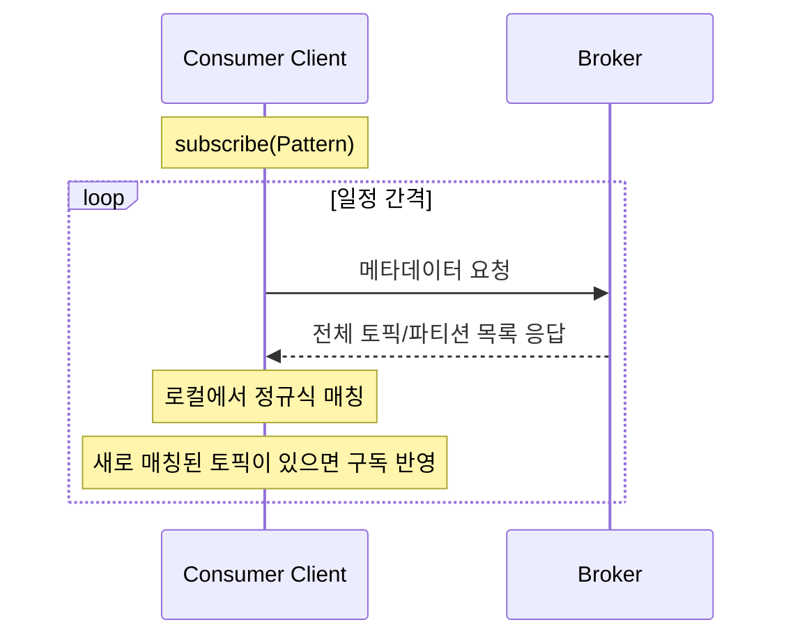
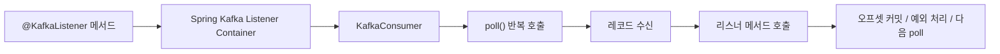

# [Chapter 4] 카프카 컨슈머: 카프카에서 데이터 읽기

카프카에서 데이터를 읽는 애플리케이션은 토픽을 구독하고 구독한 토픽들로부터 메시지를 받기 위해 `KafkaConsumer` 를 사용한다. 카프카에서 데이터를 읽는 것은 다른 메시지 전달 시스템에서 데이터를 읽는 것과는 조금 다르다.

<aside>
👨‍💻

> Messages (aka Records) are always written in batches. The technical term for a batch of messages is a record batch, and a record batch contains one or more records. In the degenerate case, we could have a record batch containing a single record. Record batches and records have their own headers. The format of each is described below.
https://kafka.apache.org/42/implementation/message-format/
> 

메시지(레코드라고도 함)는 항상 일괄 처리(batch) 방식으로 기록됩니다. 메시지 일괄 처리를 레코드 일괄 처리(record batch)라고 하며, 레코드 일괄 처리에는 하나 이상의 레코드가 포함됩니다. 드물게 레코드 일괄 처리에 단일 레코드만 포함될 수도 있습니다. 레코드 일괄 처리와 레코드는 각각 고유한 헤더를 가지고 있습니다.

</aside>

# 4.1 카프카 컨슈머: 개념

카프카로부터 데이터를 읽어 오는 방법을 이해하기 위해서는 먼저 컨슈머와 컨슈머 그룹을 이해해야 한다.

## 4.1.1 컨슈머와 컨슈머 그룹

- 카프카 토픽으로부터 메시지를 읽어 몇 가지 검사한 후, 다른 데이터 저장소에 저장하는 애플리케이션을 개발해야 한다고 가정
    - 만약 프로듀서가 애플리케이션이 검사할 수 있는 속도보다 더 빠른 속도로 토픽에 메시지를 쓰게 된다면 (컨슈머가 하나 일 때) 애플리케이션은 새로 추가되는 메시지의 속도를 따라잡을 수 없기 때문에 메시지 처리가 계속해서 뒤로 밀린다
- 그래서 토픽으로부터 데이터를 읽어 오는 작업을 확장할 수 있어야 함
- 여러 개의 프로듀서가 동일한 토픽에 메시지를 쓰듯, 여러 개의 컨슈머가 같은 토픽으로부터 데이터를 분할해서 읽어올 수 있게 해야 한다
- 카프카 컨슈머는 보통 컨슈머 그룹의 일부로서 작동
    - 동일한 컨슈머 그룹에 속한 여러 컨슈머들이 동일한 토픽을 구독할 경우, 각각의 컨슈머는 해당 토픽에서 서로 다른 파티션에서 메시지를 받는 것


네 개의 파티션을 갖는 T1 토픽이 있을 때, 컨슈머 그룹에 속한 컨슈머1이 해당 토픽을 구독하면 네 파티션 모두에서 모든 메시지를 받게 된다.


새로운 컨슈머2를 추가하게 되면 각각의 컨슈머는 2개의 파티션에서 메시지를 받으면 된다. 이후 컨슈머가 4개로 늘어나면, 각각의 컨슈머가 하나의 파티션에서 메시지를 읽어오게 된다. 다만, 파티션보다 컨슈머의 수가 많아지면 유휴 컨슈머가 생기게 된다.

- 컨슈머 그룹에 컨슈머를 추가하는 것은 카프카 토픽에서 읽어오는 데이터 양을 확장하는 주된 방법
- 컨슈머가 지연 시간이 긴 작업(데이터베이스 쓰기, 오랜 연산 수행)을 수행하는 것은 흔함
    - 하나의 컨슈머로 토픽에 들어오는 데이터의 속도를 감당할 수 없을 수도 있기 때문에 컨슈머를 추가함으로써 단위 컨슈머가 처리하는 파티션과 메시지의 수를 분산시키는 것이 일반적인 규모 확장 방식
- 토픽을 생성할 때 파티션 수를 크게 잡아주면 부하가 증가함에 따라 더 많은 컨슈머를 추가할 수 있게 함

> 토픽에 설정된 파티션 수를 초과해서 컨슈머를 생성하는 것은 아무 의미가 없다!
→ 토픽의 파티션 수를 선정하는 방법은 2장을 참고
> 
- 규모 확장을 위해 컨슈머 수를 늘리는 경우 이외에도 여러 애플리케이션이 동일한 토픽에서 데이터를 읽어와야 하는 경우 역시 흔함
- 카프카의 주 디자인 목표 중 하나는 카프카 토픽에 쓰여진 데이터를 전체 조직 안에서 여러 용도로 사용할 수 있도록 만드는 것이었음
    - 이렇게 하려면 각자의 컨슈머 그룹을 갖도록 구성해야 함
    - 다른 메시지 전달 시스템과는 다르게 카프카는 성능 저하 없이 많은 수의 컨슈머와 컨슈머 그룹으로 확장 가능


만약 새로운 컨슈머 그룹이 추가된다면 이 컨슈머 그룹은 컨슈머 그룹1에서 무엇을 하고 있든지 상관없이 T1 토픽의 모든 메시지를 받게 된다.

## 4.1.2 컨슈머 그룹과 파티션 리밸런스

- 컨슈머 그룹에 속한 컨슈머들은 자신들이 구독한 토픽의 파티션들에 대한 소유권 공유
- 새로운 컨슈머를 컨슈머 그룹에 추가하면 이전에 다른 컨슈머가 읽고 있던 파티션으로부터 메시지를 읽기 시작
- 컨슈머가 종료되거나 크래시되어 컨슈머 그룹에서 나가면 해당 컨슈머가 읽던 파티션들은 그룹에 남은 컨슈머 중 하나가 대신 읽기 시작
- 컨슈머에 파티션을 재할당(ressignment)하는 작업은 컨슈머 그룹이 읽고 있는 토픽이 변경되었을 때도 발생
    - 토픽에 새로운 파티션을 추가했을 경우
- 컨슈머에 할당된 파티션을 다른 컨슈머에게 할당해주는 작업을 리밸런스(rebalance)라고 함
    - 리밸런스는 컨슈머 그룹에 높은 가용성(high availability)과 규모 가변성(scalability)을 제공하여 매우 중요

### 조급한 리밸런스(eager rebalance)

- 조급한 리밸런스가 실행되면 모든 컨슈머는 읽기 작업을 멈추고 자신에게 할당된 모든 파티션에 대한 소유권을 포기한 뒤, 컨슈머 그룹에 다시 참여하여 완전히 새로운 파티션을 할당
    - 전체 컨슈머 그룹에 대해 짧은 시간 동안 작업을 멈추게 함

- 모든 컨슈머가 할당된 파티션을 포기하고, 컨슈머 모두가 다시 그룹에 참여한 뒤에 새로운 파티션을 할당받고 읽기 작업을 재개할 수 있음

### 협력적 리밸런스(cooperative rebalance)

- 협력적 리밸런스 또는 점진적 리밸런스(incremental rebalance)의 경우 한 컨슈머에게 할당되어 있던 파티션만 다른 컨슈머에 재할당
- 재할당되지 않은 파티션에서 레코드를 읽던 컨슈머들은 작업에 방해받지 않고 하던 일을 할 수 있음
- 리밸런싱은 2개 이상의 단계에 걸쳐서 수행
    - 우선 컨슈머 그룹 리더가 다른 컨슈머들 각자에게 할당된 파티션 중 일부가 재할당될 것이라고 통보하면, 컨슈머들은 해당 파티션에서 데이터를 읽어오는 작업을 멈추고 파티션 소유권을 포기
    - 이후 컨슈머 그룹 리더가 포기된 파티션들을 재할당
- 이 방식은 조급한 리밸런스 방식에서 발생하는 전체 작업이 중단되는 사태(stop the world)가 발생하지 않고 안정적으로 파티션이 할당될 때까지 반복될 수 있음
- 리밸런싱 작업에 상당한 시간이 걸릴 위험이 있는 컨슈머 그룹에 속한 컨슈머 수가 많은 경우 특히 중요

- 컨슈머는 해당 컨슈머 그룹의 그룹 코디네이터 역할을 지정받은 카프카 브로커(컨슈머 그룹별로 다를 수 있음)에 하트비트를 전송함으로써 멤버십과 할당된 파티션에 대한 소유권 유지
    - 하트비트는 컨슈머의 백그라운드 스레드에 의해 전송
    - 일정한 간격을 두고 전송되는한 연결이 유지되고 있는 것으로 간주
- 컨슈머가 일정 시간 이상 하트비트를 전송하지 않으면 세션 타임아웃이 발생하여 그룹 코디네이터는 해당 컨슈머가 죽었다고 간주하고 리밸런스 실행
- 컨슈머가 크래시 나서 메시지 처리를 중단했을 경우에도 하트비트가 들어오지 않는 것을 보고 리밸런스 실행
- 컨슈머를 깔끔하게 닫아줄 경우 컨슈머는 그룹 코디네이터에게 그룹을 나간다고 통지하는데, 그러면 즉시 리밸런스를 실행하여 처리 정지 시간을 줄일 수 있음

<aside>
👨‍💻

그룹 코디네이터는 각 컨슈머 그룹의 상태를 관리하는 브로커 역할이다. 즉, 컨슈머 그룹마다 담당 브로커가 정해져 있고, 그 브로커가 해당 그룹의 코디네이터 역할을 수행한다. 

담당하는 핵심 기능은 다음과 같다.

- 컨슈머 그룹 멤버십 관리
    - 컨슈머가 들어오고, 나가고, 죽었는지 추적
- 리밸런스 트리거
    - 새 컨슈머가 들어오거나, 기존 컨슈머가 나가거나, 하트비트가 끊기면 리밸런스 시작
- 파티션 할당 절차 조율
    - 어떤 파티션을 누구에게 줄지 계산하지는 않음
    - 그룹의 컨슈머 리더가 할당안을 만들고, 코디네이터는 과정을 중재하고 결과를 컨슈머에게 전달
- 오프셋 커밋 관리
</aside>

<aside>
❓

**파티션은 어떻게 컨슈머에게 할당되는가?**

컨슈머가 그룹에 참여하고 싶을 때는 그룹 코디네이터(브로커 중 하나)에게 JoinGroup 요청을 보낸다. 가장 먼저 그룹에 참여한 컨슈머가 그룹 리더가 된다. 리더는 그룹 코디네이터로부터 해당 그룹에 있는 살아있는 모든 컨슈머 목록을 받아 각 컨슈머에게 파티션의 일부를 할당해 준다. 어느 컨슈머에게 할당되어야 하는지를 결정하기 위해서는 `PartitionAssignor` 인터페이스의 구현체가 사용된다.

카프카에는 몇 개의 파티션 할당 정책이 내장되어 있고, 파티션 할당이 결정되면 컨슈머 그룹 리더는 할당 내역을 `GroupCoordinator` 에게 전달하고 그룹 코드네이터는 이 정보를 모든 컨슈머에게 전파한다.

컨슈머 입장에서는 자신에게 할당된 내역만 보이고, 리더만 클라이언트 프로세스 중에서 유일하게 그룹 내 컨슈머와 할당 내역 전부를 볼 수 있다.

</aside>

<aside>
🚨

3.1부터는 협력적 리밸런스가 기본값이 되었고, 조급한 리밸런스는 추후 삭제될 예정이다.

</aside>

## 4.1.3 정적 그룹 멤버십

- 컨슈머가 갖는 컨슈머 그룹의 멤버로서의 자격(멤버십)은 일시적
- 컨슈머가 컨슈머 그룹을 떠나는 순간 해당 컨슈머에 할당되어 있던 파티션들은 해제되고, 재참여 시 새로운 멤버ID가 발급되며 리밸런스 프로토콜에 의해 새로운 파티션들이 할당
- 이 설명은 컨슈머에 고유한 `group.instance.id` 값을 잡아주지 않는 한 유효
    - 해당 설정은 컨슈머가 컨슈머 그룹의 정적인 멤버가 되도록 함
- 컨슈머가 정적 멤버로서 컨슈머 그룹에 처음 참여하면 해당 그룹이 사용하고 있는 파티션 할당 전략에 따라 파티션 할당
    - 하지만 이 컨슈머가 꺼질 경우, 자동으로 그룹을 떠나지 않음
    - 세션 타임아웃이 경과될 때까지 그룹 멤버로 남음
    - 그리고 컨슈머가 다시 그룹에 참여하면 멤버십이 그대로 유지되기 때문에 리밸런스 발생 없이 예전 할당받았던 파티션을 그대로 재할당 받음
- 그룹 코디네이터는 그룹 내 각 멤버에 대한 파티션 할당을 캐시해 두고 있어 정적 멤버가 다시 참여해도 리밸런스를 발생시키지 않음
    - 캐시되어 있는 파티션 할당을 보내 주면 되기 때문
- 만약 같은 `group.instance.id` 값을 갖는 두 개의 컨슈머가 같은 그룹에 참여하면, 두 번째 컨슈머에는 동일한 ID를 같는 컨슈머가 이미 존재한다는 에러가 발생
- 정적 그룹 멤버십은 애플리케이션이 각 컨슈머에 할당된 파티션의 내용물을 사용해서 로컬 상태나 캐시를 유지해야 할 때 편리
    - 캐시를 재생성하는 것이 오랜 시간이 거릴 때, 컨슈머가 재시작할 때마다 이 작업을 반복하지 않음
    - 그리고 컨슈머에 할당된 파티션들이 해당 컨슈머가 재시작한다고 해서 다른 컨슈머로 재할당되지 않음
    - 컨슈머가 정지한 파티션은 다른 컨슈머에서 메시지를 읽지 않기 때문에 컨슈머가 다시 돌아오면 한참 뒤에 있는 밀린 메시지부터 처리
    - 그래서 컨슈머가 재시작했을 때 밀린 메시지를 따라잡을 수 있는지 확인할 필요가 있음
- 정적 멤버가 종료되었음을 알아차리는 것은 `session.timeout.ms` 설정에 달려있음
    - 이 값은 단순히 애플리케이션 재시작이 리밸런스를 작동시키지 않을 만큼 충분히 크면서, 시간 동안 작동이 멈출 경우 자동으로 파티션 재할당이 이루어져서 오랫동안 파티션 처리가 멈추는 상황을 막을 수 있을 만큼 충분히 작은 값으로 설정할 필요가 있음

---

# 4.2 카프카 컨슈머 생성하기

카프카 컨슈머를 생성하기 위해서 `bootstrap.servers` , `key.serializer` , `value.serializer` 가 반드기 지정되어야 한다.

- `bootstrap.servers` : 카프카 클러스터로의 연결 문자열
- `key.serializer` , `value.serializer` : 바이트 배열을 자바 객체로 변환하는 클래스를 지정
- `group.id` : 컨슈머 그룹을 지정

---

# 4.3 토픽 구독하기

컨슈머를 생성하고 나서 다음으로 할 일은 1개 이상의 토픽을 구독하는 것이다.

```java
consumer.subscribe(Collections.singletonList("customerCountries"));
```

정규식을 매개변수로 사용해서 `subscribe` 를 호출하는 것도 가능하다. 정규식은 다수의 토픽 이름에 매치될 수 있으며, 정규식과 매치되는 이름을 가진 새로운 토픽을 생성할 경우, 거의 즉시 리밸런스가 발생하여 컨슈머들은 새로운 토픽으로부터 읽기 작업을 시작한다.

```java
// 모든 테스트 토픽을 구독하는 경우
consumer.subscribe(Pattern.compile("test.*"));
```

<aside>



카프카 클러스터에 파티션이 매우 많다면 구독할 토픽을 필터링하는 작업은 클라이언트 쪽에서 이루어지는 것을 염두해야 한다. 전체 토픽의 일부를 구독할 때 명시적으로 목록으로 지정하는 것이 아닌 정규식으로 지정할 경우 컨슈머는 전체 토픽과 파티션에 대한 정보를 브로커에 일정한 간격으로 요청하게 된다. 클라이언트는 이 목록을 구독할 새로운 토픽을 찾아내는 데 쓴다. 

만약 토픽의 목록이 크고, 컨슈머도 많으며 파티션의 목록 크기도 클 경우 정규식을 사용한 구독은 브로커, 클라이언트, 네트워크 전체에 걸쳐 상당한 오버헤드를 발생시킨다.

</aside>

---

# 4.4 폴링 루프

컨슈머 API의 핵심은 서버에서 추가 데이터가 들어왔는지 폴링하는 단순한 루프다.

```java
Duration timeout = Duration.ofMillis (100);

while (true) { // 1
	ConsumerRecords<String, String> records = consumer.poll(timeout); // 2

	for (ConsumerRecord<String, String> record : records) { // 3 
		System.out.printf("topic = %s, partition = %d, offset =%d," + 
										"customer = %s, country =%s\n", 
		record.topic(), record.partition(), record.offset(), 
		record.key(), record.value()); 
		int updatedCount = 1; 
		
		if (custCountryMap.containsKey(record.value())) {
			updatedCount = custCountryMap.get(record value()) + 1;
		}
		
		custCountryMap.put(record.value(), updatedCount);
		JSONObject json = new JSONObject(custCountryMap);
		System. out.println(json.toString());
	}
}
```

1. 이 루프는 무한 루프이기 때문에 종료되지 않는다. 컨슈머 애플리케이션은 카프카에 추가 데이터를 폴링하는 오랫동안 돌아가는 애플리케이션이다.
2. 가장 중요한 코드로 컨슈머는 카프카를 계속해서 폴링하지 않으면 죽은 것으로 간주되어 이 컨슈머가 읽어오고 있던 파티션들은 그룹 내의 다른 컨슈머에게 넘겨진다. `poll()` 에 들어가는 매개변수는 컨슈머 버퍼에 데이터가 없을 경우 `poll()` 이 블록될 수 있는 최대 시간을 결정한다. 만약 0으로 지정하거나, 버퍼 안에 이미 레코드가 준비되어 있을 경우 `poll()` 은 즉시 리턴된다.
3. `poll()` 은 레코드들이 저장된 List 객체를 리턴한다. 각 레코드는 토픽, 파티션, 파티션의 오프셋과 키, 밸류값을 포함한다. 이 List를 반복해 가며 각 레코드를 하나씩 처리한다.

새 컨슈머에서 처음으로 `poll()` 을 호출하면 컨슈머는 그룹 코디네이터를 찾아서 컨슈머 그룹에 참가하고, 파티션을 할당 받는다. 리밸런스도 연관 콜백들과 함께 여기서(poll) 처리된다. 즉, 컨슈머 혹은 콜백에서 잘못될 수 있는 모든 것들은 `poll()` 에서 예외 형태로 발생되는 것이다.

`poll()` 이 `max.poll.interval.ms` 에 지정된 시간 이상으로 호출되지 않을 경우, 컨슈머는 죽은 것으로 판정되어 컨슈머 그룹에서 퇴출된다. 그래서 폴링 루프 안에서 예측 불가능한 시간 동안 블록되는 작업을 수행하는 것은 피해야 한다.

<aside>
👨‍💻

### `@KafkaListener` 를 사용하면?

```java
애플리케이션 코드
  -> @KafkaListener 메서드 작성

Spring Kafka
  -> KafkaMessageListenerContainer / 
		 ConcurrentMessageListenerContainer 생성
  -> 내부에서 Consumer 생성
  -> 백그라운드 스레드로 poll() 반복 호출
  -> poll()로 받은 레코드를 @KafkaListener 메서드에 전달
```

Spring Kafka의 리스너 컨테이너가 폴링 루프를 대신 실행한다.

```java
@KafkaListener(topics = "orders")
public void listen(String message) {
    // 메시지 처리
}
```

`@KafkaListener` 메서드는 `poll()` 로 가져온 레코드를 처리하는 콜백이다.



1. Spring 컨테이너가 Consumer를 생성
2. Consumer가 그룹 코디네이터에 참가
3. 파티션이 할당
4. 내부 스레드가 poll()을 계속 호출
5. poll()이 레코드를 반환하면 Spring이 listen(...)을 호출
6. 설정된 ack 모드에 따라 오프셋을 커밋
</aside>

<aside>
👨‍💻

**브로커에게 받은 레코드들은 컨슈머에서 어떻게 처리될까?**

```java
private ConsumerRecords<K, V> poll(final Timer timer) {
  acquireAndEnsureOpen();
  try {
    this.kafkaConsumerMetrics.recordPollStart(timer.currentTimeMs());

    if (this.subscriptions.hasNoSubscriptionOrUserAssignment()) {
        throw new IllegalStateException("Consumer is not subscribed to any topics or assigned any partitions");
    }

    do {
        client.maybeTriggerWakeup();

        // try to update assignment metadata BUT do not need to block on the timer for join group
        updateAssignmentMetadataIfNeeded(timer, false);

        final Fetch<K, V> fetch = pollForFetches(timer);
        if (!fetch.isEmpty()) {
            // before returning the fetched records, we can send off the next round of fetches
            // and avoid block waiting for their responses to enable pipelining while the user
            // is handling the fetched records.
            //
            // NOTE: since the consumed position has already been updated, we must not allow
            // wakeups or any other errors to be triggered prior to returning the fetched records.
            if (sendFetches() > 0 || client.hasPendingRequests()) {
                client.transmitSends();
            }

            if (fetch.records().isEmpty()) {
                log.trace("Returning empty records from `poll()` "
                        + "since the consumer's position has advanced for at least one topic partition");
            }

            return this.interceptors.onConsume(new ConsumerRecords<>(fetch.records(), fetch.nextOffsets()));
        }
    } while (timer.notExpired());

    return ConsumerRecords.empty();
  } finally {
    release();
    this.kafkaConsumerMetrics.recordPollEnd(timer.currentTimeMs());
  }
}
```

> 
> 
> 
> ✅ `pollForFetches()` 이후 주석 내용
> before returning the fetched records, we can send off the next round of fetches and avoid block waiting for their responses to enable pipelining while the user is handling the fetched records.
> 
> NOTE: since the consumed position has already been updated, we must not allow wakeups or any other errors to be triggered prior to returning the fetched records.
> 
> 조회된 레코드를 반환하기 전에 다음 조회 작업을 미리 실행하여, 사용자가 조회된 레코드를 처리하는 동안 응답을 기다리며 발생하는 블록 현상을 피함으로써 파이프라인 처리를 가능하게 할 수 있습니다.
> 
> 참고: 처리된 위치가 이미 업데이트되었으므로, 조회된 레코드를 반환하기 전에 웨이크업이나 기타 오류가 발생하지 않도록 해야 합니다.
> 

pollForFetches() 내부에서 레코드를 수집하면서 offset(consumed position)이 이미 전진합니다. 이 시점에서 만약 wakeup()이나 예외가 발생해 레코드를 반환하지 못하면:

- offset은 전진했는데 (다음에 그 위치부터 읽음)
- 사용자는 레코드를 받지 못한 상태

→ 해당 레코드가 유실됩니다.

그래서 sendFetches() ~ return 사이 구간에서는 wakeup 인터럽트나 에러를 절대 허용하지 않아야 한다는 안전 주석입니다. (실제로 이 구간에서는 client.poll() 대신 client.transmitSends()만 호출하는 이유이기도 합니다. poll()은 wakeup 체크를 하지만 transmitSends()는 하지 않습니다.)

```bash
poll() 호출                                                                                                                                                                                                                                                                                                  
 └─ pollForFetches()                                                                                                                                                                                                                                                                                        
    ├─ collectFetch() → 버퍼 확인                                                                                                                                                                                                                                                                         
    │  ├─ 있으면 즉시 반환 ✓                                                                                                                                                                                                                                                                            
    │  └─ 없으면 → sendFetches() → client.poll() 블로킹 대기 → collectFetch()                                                                                                                                                                                                                           
    │                                                                                                                                                                                                                                                                                                     
    └─ 레코드 수신 후 poll() 반환 직전에 → sendFetches() ← 여기가 prefetch 
```

현재 `poll()` 에서 레코드를 받아 반환하기 직전, 다음 `FetchRequest` 를 브로커에 미리 전송해둔다. 사용자가 현재 배치를 처리하는 시간 동안 브로커도 다음 배치를 준비하므로, 다음 poll() 호출 시 블로킹 대기 시간이 단축될 수 있다. 단, 항상 버퍼에서만 꺼내는 것은 아니고, prefetch 응답이 아직 안 왔다면 여전히 블로킹한다.

브로커로부터 레코드 배치를 받아 컨슈머 내부 버퍼에 저장하게 된다. 이후 `ConsumerRecords` 로 변환되어 순차적으로 처리된다.

```bash
애플리케이션
  -> poll() 호출
컨슈머 클라이언트
  -> 내부 버퍼 확인
  -> 필요하면 FetchRequest 전송
브로커
  -> FetchResponse 반환
컨슈머 클라이언트
  -> ConsumerRecords로 조립
애플리케이션
  -> poll() 결과 수신
```

이 때 `poll()` 한 번이 무조건 브로커로 요청이 가는 것은 아니다. 즉, `poll()` 호출 당 네트워크 왕복이 발생하는 것이 아닌 것이다. 

만약, `fetch response` 로 레코드 100개 반환되었을 때(레코드 100개가 `fetch.max.bytes` 보다 적은 바이트 수임을 가정) 컨슈머가 내부 버퍼에 저장한다. 이 때 `max.poll.records=20` 으로 설정되어 있다면, `poll()` 한 번당 20개만 애플리케이션으로 전달되고, 80개가 버퍼에 남게 된다. 그래서 다음 `poll()` 호출 시 버퍼에 남은 레코드가 반환된다.

</aside>

## 4.4.1 스레드 안정성

- 하나의 스레드에서 동일한 그룹 내에 여러 개의 컨슈머를 생성할 수 없으며, 같은 컨슈머를 다수의 스레드가 안정하게 사용할 수 없음
    - 하나의 스레드당 하나의 컨슈머가 원칙
- 하나의 애플리케이션에서 동일한 그룹에 속하는 여러 개의 컨슈머를 운용하고 싶다면 스레드를 여러 개 띄워 각 컨슈머를 하나씩 돌려야 한다.

---

# 4.5 컨슈머 설정하기

- 정리 순서
    
    컨슈머 설정을 정리할 때는 성능보다 먼저 정확성, 리밸런스, 장애 복구에 영향을 주는 것부터 보는 게 맞다.
    
    추천 순서는 아래다.
    
    **1. 오프셋 처리 의미부터**
    
    1. enable.auto.commit
    2. auto.offset.reset
    
    이 둘이 먼저다.
    
    이 설정이 "언제 읽은 것으로 간주할지", "커밋이 없을 때 어디서부터 읽을지"를 결정해서 중복 처리, 유실, 재처리 의미를 좌우한다.
    
    **2. 컨슈머 생존과 리밸런스**
    
    1. session.timeout.ms
    2. heartbeat.interval.ms
    3. max.poll.interval.ms
    
    이 셋은 반드시 같이 봐야 한다.
    
    session.timeout.ms는 죽었다고 판단하는 기준, heartbeat.interval.ms는 살아있음을 알리는 주기, max.poll.interval.ms는 애플리케이션이 너무 오래 poll()하지 않을 때 리밸런스를 일으키는 기준이다.
    
    **3. 파티션 할당 방식**
    
    1. partition.assignment.strategy
    2. group.instance.id
    
    partition.assignment.strategy는 리밸런스 품질과 파티션 분배 방식을 결정한다.
    
    group.instance.id는 static membership에 쓰여서 재시작 시 불필요한 리밸런스를 줄이는 데 중요하다.
    
    **4. 한 번에 얼마나 가져오고 얼마나 처리할지**
    
    1. max.poll.records
    2. max.partition.fetch.bytes
    3. fetch.max.bytes
    
    이 구간은 컨슈머 처리량과 메모리 사용량에 직접 영향이 있다.
    
    특히 max.poll.records는 애플리케이션 처리 시간과 max.poll.interval.ms와 같이 봐야 한다.
    
    **5. fetch 지연 시간과 배치 크기**
    
    1. fetch.min.bytes
    2. fetch.max.wait.ms
    
    이 둘은 지연 시간과 효율의 트레이드오프다.
    
    작게 잡으면 빠르지만 요청이 많아지고, 크게 잡으면 배치 효율은 좋아지지만 응답이 늦어진다.
    
    **6. 요청 타임아웃**
    
    1. request.timeout.ms
    2. default.api.timeout.ms
    
    장애 상황에서 얼마나 빨리 실패로 간주할지 정하는 값이다.
    
    문제 분석할 때 중요하지만, 앞의 오프셋/리밸런스보다는 우선순위가 낮다.
    
    **7. 식별, 랙 인식, 네트워크 튜닝**
    
    1. client.id
    2. client.rack
    3. receive.buffer.bytes
    4. send.buffer.bytes
    
    운영 관측성과 네트워크 최적화용이다.
    
    중요하지만 처음 정리할 핵심 축은 아니다.
    
    **8. 마지막으로 구분해서 적어야 할 것**
    
    1. offsets.retention.minutes

## 4.5.1 `fetch.min.bytes`

- 컨슈머가 브로커로부터 레코드를 얻어올 때 받는 데이터의 최소량(바이트)를 지정
    - 기본값: `1바이트`
- 만약 브로커가 컨슈머로부터 레코드 요청을 받았는데 새로 보낼 레코드의 양이 해당 설정값보다 작을 경우, 브로커는 충분한 메시지를 보낼 수 있을 때까지 기다린 뒤 컨슈머에게 전송
    - 이는 토픽에 새로운 메시지가 많이 들어오지 않거나 하루 중 쓰기 요청이 적은 시간대일 때 오가는 메시지 수를 줄여 컨슈머와 브로커에 부하를 줄여주는 효과가 있음
- 읽어올 데이터가 많지 않을 때 컨슈머가 CPU 자원을 너무 많이 사용하거나 컨슈머 수가 많을 때 브로커 부하를 줄여야 할 경우 이 값을 기본값보다 더 올려잡아 주는 게 좋음
    - 이 값을 증가 시킬 경우 처리량이 적은 상황에서 지연도 증가 할 수 있음

## 4.5.2 `fetch.max.wait.ms`

- `fetch.min.bytes` 를 설정하여 카프카가 컨슈머에게 응답하기 전 충분한 데이터가 모일 때까지 기다릴 수 있음
- 해당 설정은 얼마나 오래 기다릴 것인지 결정
    - 기본값: `500ms`
- 카프카는 컨슈머에게 리턴할 데이터가 부족할 경우 리턴할 최소량을 맞추기 위해 `500ms` 까지 대기
- 잠재적인 지연을 제한하고 싶을 경우 해당 설정값을 더 작게 잡아주면 됨

## 4.5.3 `fetch.max.bytes`

- 컨슈머가 브로커를 폴링할 때 카프카가 리턴하는 최대 바이트 수를 지정
    - 기본값: `50MB`
- 컨슈머가 서버로부터 받은 데이터를 저장하기 위해 사용하는 메모리 양을 제한하기 위함
    - 얼마나 많은 파티션으로부터 얼마나 많은 메시지를 받았는지와는 무관
- 브로커가 컨슈머에 레코드를 보낼 때는 배치 단위로 전송
    - 만약 브로커로 보내야 하는 첫 번째 레코드 배치의 크기가 이 설정값을 넘길 경우, 제한값을 무시하고 해당 배치를 그대로 전송
    - 이것은 컨슈머가 읽기 작업을 계속 진행할 수 있도록 보장
- 브로커 설정에도 최대 읽기 크기를 제한할 수 있는 설정이 있는 것을 짚고 가자
    - 대량의 데이터에 대한 요청은 대량의 디스크 읽기와 오랜 네트워크 전송 시간을 초래하여 브로커 부하를 증가시킬 수 있기 때문에, 이런 사태를 막기 위해 브로커 설정을 사용할 수 있음

<aside>
👨‍💻

즉, 해당 설정은 어느 파티션에서 가져오는 것과 상관없이 한 번의 fetch 요청 당 최대 바이트 수를 설정하는 것이다.

> A fetch request consists of many partitions, and there is another setting that controls how much data is returned for each partition in a fetch request - see `max.partition.fetch.bytes`
https://kafka.apache.org/42/configuration/consumer-configs/#consumerconfigs_fetch.max.bytes
데이터 가져오기 요청은 여러 파티션으로 구성되며, 각 파티션에 대해 반환되는 데이터 양을 제어하는 또 다른 설정이 있습니다(max.partition.fetch.bytes 참조).
> 
</aside>

## 4.5.4 `max.poll.records`

- `poll()` 을 호출할 때마다 리턴되는 최대 레코드 수를 지정
- 애플리케이션에서 폴링 루프를 반복할 때마다 처리해야 하는 레코드의 개수(크기가 아님)를 제어하려면 이 설정을 사용

## 4.5.5 `max.partition.fetch.bytes`

- 서버가 파티션별로 리턴하는 최대 바이트 수를 결정
    - 기본값: `1MB`
- `KafkaConsumer.poll()` 가 `ConsumerRecords` 를 리턴할 때, 메모리 상에 저장된 레코드 객체의 크기는 컨슈머에 할당된 파티션별로 최대 `max.partition.fetch.bytes` 까지 차지할 수 있음
- 브로커가 보내온 응답에 어느정도의 파티션이 포함되어 있는지 결정할 방법은 없기 때문에 이 설정을 사용해서 메모리 사용량을 조절하는 것은 꽤 복잡함
- 각 파티션에서 비슷한 양의 데이터를 받아서 처리해야 하는 특별한 이유가 아닌 한 `fetch.max.bytes` 를 사용할 것을 강력히 권장

## 4.5.6 `session.timeout.ms` 그리고 `heartbeat.interval.ms`

- 컨슈머가 브로커와 신호를 주고받지 않아도 살아 있는 것으로 판정되는 최대 시간의 기본값은 10초
- 만약 컨슈머가 그룹 코디네이터에게 하트비트를 보내지 않은 채로 `session.timeout.ms` 가 지나가면 그룹 코디네이터는 컨슈머가 죽은 것으로 간주하고, 리밸런스를 실행
- `session.timeout.ms` 는 컨슈머가 하트비트를 보내지 않을 수 있는 최대 시간을 결정하기 때문에 대개 함께 변경됨
    - `heartbeat.interval.ms` 는 `session.timeout.ms` 보다 더 낮아야 하고, 보통 `1/3` 으로 결정
- `session.timeout.ms` 를 기본값보다 낮추면 컨슈머 그룹이 죽은 컨슈머를 좀 더 빨리 찾아내고 회복할 수 있지만, 원치않는 리밸런싱을 초래할 수 있음
    - 반대로 높이면 사고로 인한 리밸런스 가능성은 줄일 수 있지만, 실제로 죽은 컨슈머를 찾아내는 데는 시간이 더 소요

<aside>
👨‍💻

- 버전 3.0부터 `session.timeout.ms`  의 기본값이 45초로 변경
- 10초는 카프카 개발 초기 온프레미스 환경을 기준으로 정해진 것이기 때문에 순간적인 부하 집중과 네트워크 불안정이 일상인 클라우드 환경에는 적절하지 않음
- 즉, 순간적인 네트워크 문제로 인해 리밸런스가 발생하고 컨슈머 작동이 정지될 수 있기 때문
- 그래서 `1/3` 으로 설정한다는 규칙이 기본값에서는 유효하지 않게 됨
</aside>

## 4.5.7 `max.poll.interval.ms`

- 컨슈머가 폴링 하지 않고도 죽은 것으로 판정되지 않을 수 있는 최대 시간을 지정
- 하트비트와 세션 타임아웃 설정은 카프카가 죽은 컨슈머를 찾아내고 할당된 파티션을 해제할 수 있게 해주는 매커니즘
    - 하트비트는 백그라운드 스레드에 의헤 전송
    - 카프카에서 레코드를 읽어오는 메인 스레드는 데드락이 걸렸는데 백그라운드 스레드가 하트비트를 전송하고 있을 수 있음
    - 이는 컨슈머에 할당된 파티션의 레코드들이 처리되고 있지 않음을 의미
- 컨슈머가 추가로 메시지를 요청하는지 확인하는 것이 컨슈머가 레코드를 처리하고 있는지 확인하는 가장 쉬운 방법
    - 다만 요청 사이의 간격이나 추가 레코드 요청은 예측하기 힘들고, 현재 사용 가능한 데이터의 양, 컨슈머가 처리하고 있는 작업 유형, 함께 사용되는 서비스의 지연에도 영향을 받음
- 리턴된 레코드 각각에 대해 시간이 오래 걸리는 처리를 해야 하는 애플리케이션의 경우 리턴되는 데이터의 양을 제한하기 위해 `max.poll.records` 를 사용할 수 있고, `poll()` 을 다시 호출할 수 있을 때까지 걸리는 시간도 제한할 수 있음
    - `max.poll.records` 를 정의했어도 `poll()` 호출하는 시간 간격은 예측하기 어려워 안정장치 내지 예방 조치로 `max.poll.interval.ms` 가 사용
- 이 값은 정상 작동 중인 컨슈머가 매우 드물게 도달할 수 있도록 충분히 크게, 정지한 컨슈머로 인한 영향이 뚜렷이 보이지 않을 만큼 충분히 작게 설정되어야 함
    - 기본값: `5분`
- 타임아웃이 발생하면 백그라운드 스레드는 브로커로 하여금 컨슈머가 죽어서 리밸런스가 수행되어야 한다는 것을 알 수 있도록 `leave group` 요청을 보낸 뒤 하트비트 전송을 중단

<aside>
👨‍💻

`session.timeout.ms` 그리고 `heartbeat.interval.ms` 로는 잡을 수 없는 컨슈머 스레드의 장애(다음 메시지를 폴링하지 못하는)를 해당 설정을 통해 해결 할 수 있는 것으로 보인다.

`max.poll.records` 를 너무 크게 잡으면 다음 폴링까지 오랜 시간이 소요되기 때문에 메시지 처리 속도를 확인해서 해당 매개변수 값을 적절하게 설정해야 하는 것으로 보인다.

</aside>

## 4.5.8 `default.api.timeout.ms`

- `default.api.timeout.ms`는 대부분의 컨슈머 API 호출에 적용되는 기본 타임아웃이다.
- 명시적으로 타임아웃을 주지 않았을 때 사용되며, 기본값은 1분이다.
- 다만 `poll()`에는 적용되지 않으므로 `poll()`은 별도의 타임아웃을 직접 지정해야 한다.

## 4.5.9 `request.timeout.ms`

- `request.timeout.ms`는 브로커 응답을 기다리는 최대 시간이다.
- 시간이 초과되면 클라이언트는 응답 불가로 판단하고 연결을 닫은 뒤 재연결을 시도한다.
- 기본값은 30초이며, 너무 작게 설정하면 불필요한 재연결과 오버헤드가 발생할 수 있다.

## 4.5.10 `auto.offset.reset`


- 컨슈머가 예전에 오프셋을 커밋한 적이 없거나, 커밋된 오프셋이 유효하지 않을 떄(컨슈머가 오랫동안 읽은 적이 없어서 오프셋의 레코드가 이미 브로커에서 삭제된 경우), 파티션을 읽기 시작할 때의 작동을 정의
- 기본값은 `latest` 인데, 유효한 오프셋이 없을 경우 컨슈머는 가장 최신 레코드(컨슈머가 작동하기 시작한 다음부터 쓰여진 레코드)부터 읽기 시작
- 다른 값으로 `earliest` 가 있는데, 유효한 오프셋이 없을 경우 파티션이 맨 처음부터 모든 데이터를 읽는 방식

## 4.5.11 `enable.auto.commit`

- 컨슈머가 자동으로 오프셋을 커밋할지 여부를 결정
    - 기본값: `true`
- 언제 오프셋을 커밋할지 직접 결정하고 싶다면 `false` 로 설정
    - 중복을 최소화하고 유실되는 데이터를 방지하려면 필요
- 이 값을 `true` 로 설정할 경우 `auto.commit.interval.ms` 를 사용해 얼마나 자주 오프셋이 커밋될지를 제어할 수 있음

## 4.5.12 `partition.assignment.strategy`

- `PartitionAssignor` 클래스는 컨슈머와 이들이 구독한 토픽들이 주어졌을 때 어느 컨슈머에게 어느 파티션이 할당될지를 결정하는 역할을 함
- 카프카는 다음과 같은 파티션 할당 전략(할당자 Assignor)를 지원

### Range

- 컨슈머가 구독하는 각 토픽의 파티션들을 연속된 그룹으로 나눠서 할당
- 컨슈머 C1, C2가 각각 3개의 파티션을 갖는 토픽 T1, T2를 구독했을 경우
    - C1은 T1과 T2의 0번, 1번 파티션 할당
    - C2는 두 토픽의 2번 파티션을 할당
- 토픽의 홀수 개의 파티션을 가지고 있고 각 토픽의 할당이 독립적으로 이루어지기 때문에 첫 번째 컨슈머는 두 번째 컨슈머보다 더 많은 파티션을 할당
- 이러한 현상은 토픽의 파티션 수가 컨슈머 수로 깔끔하게 나눠떨어지지 않는 상황에서 Range 할당 전략을 사용하면 발생할 수 있음

### RoundRobin

- 모든 구독된 토픽의 모든 파티션을 가져다 순차적으로 하나씩 컨슈머에 할당
- 컨슈머 C1, C2가 각각 3개의 파티션을 갖는 토픽 T1, T2를 구독했을 경우
    - C1은 T1의 0번과 2번, T2의 1번 파티션을 할당
    - C2는 T1의 1번, T2의 0번, 2번 파티션을 할당
- 만약 컨슈머 그룹내 모든 컨슈머들이 동일한 토픽을 구독한다면(실제로 그런 게 보통이다), RoundRobin 방식을 선택할 경우 모든 컨슈머들이 완전히 동일한 수(많아야 1개 차이)의 파티션을 할당 받음

### Sticky

- 해당 할당자는 두 개의 목표를 갖고 있음
    - 파티션들을 가능한 한 균등하게 할당하는 것
    - 리밸런스가 발생했을 때 가능하면 많은 파티션들이 같은 컨슈머에 할당되게 하여 할당된 파티션을 하나의 컨슈머에서 다른 컨슈머로 옮길 때 발생하는 오버헤드를 최소화하는 것
- 컨슈머들이 모두 동일한 토픽을 구독하는 상황에서 처음으로 할당된 결과물 균형 측면에서 RoundRobin 방식을 사용한 것과 그리 다르지 않음
    - 이후 할당도 비슷하지만, 이동하는 파티션 수 측면에서는 Sticky 쪽이 더 적음
- 같은 그룹에 속한 컨슈머들이 서로 다른 토픽을 구독할 경우 Sticky 할당자가 RoundRobin 보다 더 균형잡히게 됨

### Coorperative Sticky

- Sticky 할당자와 기본적으로 동일하지만, 컨슈머가 재할당되지 않은 파티션으로부터 레코드를 계속 읽어 올 수 있도록 해주는 협력적 리밸런스 지원
    - [협력적 리밸런스(cooperative rebalance)](https://www.notion.so/cooperative-rebalance-343055f590598098a198d426151908ba?pvs=21)

## 4.5.13 `client.id`

- 어떠한 문자열도 될 수 있으며, 브로커가 요청(읽기 요청)을 보낸 클라이언트를 식별하는데 사용
    - 로깅, 모니터링, 메트릭, 쿼터에서도 사용

## 4.5.14 `client.rack`

- 컨슈머는 각 파티션의 리더 레플리카로부터 메시지를 읽어 옴
- 하지만 클러스터가 다수의 데이터센터 혹은 다수의 클라우드 가용 영역에 걸쳐 설치되어 있는 경우 컨슈머와 같은 영역에 있는 레플리카로부터 메시지를 읽어 오는 것이 성능이나 비용 면에서 유리함
- 가장 가까운 레플리카로부터 읽어올 수 있게 하려면 `client.rack` 설정을 잡아 클라이언트가 위치한 영역을 식별할 수 있게 해주어야 함
    - 브로커의 `replica.selector.class` 설정 기본값을 `org.apache.kafka.common.replica.RackAwareReplicaSelector` 로 잡아주면 돔
- 클라이언트 메타데이터와 파티션 메터데이터를 활용해서 읽기 작업에 사용할 최적의 레플리카를 선택하는 커스텀 로직을 직접 구현해 넣을 수도 있음

<aside>
👨‍💻

**가까운 랙에서 읽어오기**

- 예전에는 broker.rack이 물리 서버 랙 분산 목적이었지만, 클라우드에서는 보통 가용 영역(AZ) 의미로 쓰인다.
- 클라우드에서는 컨슈머와 브로커가 다른 AZ에 있으면 네트워크 지연이 커질 수 있다.
- 이를 줄이기 위해 컨슈머에 `client.rack` 을 설정하면, 카프카는 같은 `broker.rack` 값을 가진 브로커의 레플리카를 우선적으로 읽으려 한다.
- 이 기능은 가까운 위치의 레플리카에서 읽어 지연 시간을 줄이기 위한 기능이며, Kafka 2.4.0+에서 지원된다.
- 필요하면 `ReplicaSelector` 와 `replica.selector.class` 로 읽기 대상 레플리카 선택 로직을 직접 커스터마이징할 수 있다.
</aside>

## 4.5.15 `group.instance.id`

- 컨슈머에 정적 그룹 멤버십 기능을 적용하기 위해 사용되는 설정
- [4.1.3 정적 그룹 멤버십](https://www.notion.so/4-1-3-344055f590598007966dedf83891e34a?pvs=21)

## 4.5.16 `receive.buffer.bytes`, `send.buffer.bytes`

- 데이터를 읽거나 쓸 때 소켓이 사용하는 TCP 수신 및 수신 버퍼의 크기를 가리킴
- -1로 잡아 주면 운영체제 기본값 사용
- 다른 데이터센터에 있는 브로커와 통신하는 프로듀서나 컨슈머의 경우 이 값을 올려 잡아 주는 것이 좋음
    - 대체로 이러한 네트워크 회선은 지연은 크고 대역폭은 낮기 때문

## 4.5.17 `offsets.retention.minutes`

- 이것은 브로커 설정이지만, 컨슈머 작동에 큰 영향을 미치기 때문에 주의를 기우려야 함
- 컨슈머 그룹에 현재 돌아가고 있는 컨슈머(하트비트를 보내어 멤버십을 능동적으로 유지하고 있는 멤버)들이 있는 한, 컨슈머 그룹이 각 파티션에 대해 커밋한 마지막 오프셋 값을 카프카에 의해 보존되기 때문에 재할당이 발생하거나 재시작을 한 경우에도 가져다 쓸 수 있음
- 그룹이 비게 되면 카프카는 커밋된 오프셋을 이 설정값에 지정된 기간 동안만 보관
- 커밋된 오프셋이 삭제된 상태에서 그룹이 다시 활동을 시작하며 과거에 수행했던 읽기 작업에 대한 기록이 전형 없는 새로운 컨슈머 그룹인 것처럼 작동

<aside>
👨‍💻

이 옵션의 작동 방식은 여러 번 바뀌었으므로 2.1.0 이전 버전을 사용하고 있다면 해당 버전의 공식 문서에 나와 있는 정확한 작동을 확인하기 바람

</aside>

---

# 4.6 오프셋과 커밋

`poll()` 을 호출할 때마다 카프카에 쓰여진 메시지 중에서 컨슈머 그룹에 속한 컨슈머들이 아직 읽지 않은 레코드가 리턴된다. 즉, 그룹 내의 컨슈머가 어떤 레코드를 읽었는지 판단할 수 있다는 것이다. 카프카가 다른 JMS 큐들과 다른 점은 컨슈머가 카프카를 사용해서 각 파티션에서의 위치를 추적할 수 있게 하는 것이다.

카프카에서는 파티션에서의 현재 위치를 업데이트하는 작업을 오프셋 커밋(offset commit)이라고 한다. 전통적인 MQ와는 다르게, 카프카는 레코드를 개별적으로 커밋하지 않는다. 컨슈머는 파티션에서 성공적으로 처리한 마지막 메시지를 커밋하여 앞의 모든 메시지들 역시 성공적으로 처리되었음을 암묵적으로 나타낸다.

카프카는 `__consumer_offsets` 토픽에 각 파티션별로 커밋된 오프셋을 업데이트하도록 하는 메시지를 보내어 오프셋 커밋을 수행한다. 컨슈머가 크래시되거나 새로운 컨슈머가 그룹에 추가되면 리밸런스가 발생한다. 어디서부터 작업을 재개해야 하는지를 알아내기 위해 컨슈머는 각 파티션의 마지막으로 커밋된 메시지를 읽어온 뒤 처리를 재개한다.

<aside>
👨‍💻

컨슈머가 그룹 코디네이터에 오프셋 커밋 요청을 보내고, 브로커가 내부 토픽 `__consumer_offsets` 에 기록한다.

</aside>


만약 커밋된 오프셋이 클라이언트가 처리한 마지막 메시지의 오프셋보다 작을 경우, 마지막으로 처리된 오프셋과 커밋된 오프셋 사이의 메시지들은 두 번 처리된다.


만약 커밋된 메시지가 클라이언트가 실제로 처리한 마지막 메시지의 오프셋보다 클 경우, 마지막으로 처리된 오프셋과 커밋된 오프셋 사이의 모든 메시지들은 컨슈머 그룹에서 누락되게 된다.

<aside>

**어느 오프셋이 커밋되는가?**

- 오프셋을 커밋할 때 자동으로 하건 커밋할 오프셋을 지정하지 않고 하든 상관없이, `poll()` 이 리턴한 마지막 오프셋 바로 다음 오프셋을 커밋하는 것이 기본적인 작동
    - 수동으로 특정 오프셋을 커밋하거나 특정한 오프셋 위치를 탐색할 때 이 점을 명시
- ‘클라이언트가 `poll()` 에서 받은 마지막 오프셋보다 하나 더 큰 오프셋을 커밋’ 한다고 반복적으로 쓰는 건 번거롭게 대부분의 경우 별 상관 없음
    - 그래서 기본 작동을 언급할 떄 `마지막 오프셋을 커밋한다` 는 표현을 사용할 것
        - 수동으로 오프셋을 다뤄야 할 경우 이 점을 명시

→ 즉, 카프카에서 오프셋의 의미는 `여기까지 읽었다` 가 아니라 `여기서부터 읽어라` 는 의미

</aside>

<aside>
👨‍💻

**position과 committed offset의 차이**

- position: 현재 컨슈머 인스턴스가 다음에 읽을 위치
- committed offset: 리밸런스/재시작 후 복구 기준 위치
</aside>

## 4.6.1 자동 커밋

- 오프셋을 커밋하는 가장 쉬운 방법은 컨슈머가 대신하도록 하는 것
    - `enable.auto.commit=true` 로 설정하면 컨슈머는 5초에 한 번, `poll()` 을 통해 받은 메시지 중 마지막 메시지의 오프셋을 커밋
    - `auto.commit.interval.ms` 설정을 통해 커밋 간격을 조절 가능
- 자동 커밋은 폴링 루프에 의해서 실행
    - `poll()` 수행 시 컨슈머는 커밋해야 하는지 확인 후 마지막 `poll()` 호출에서 리턴된 오프셋을 커밋
- 이 옵션을 사용할 때 발생하는 결과를 이해할 필요가 있음
    
    
    
    - 자동 커밋은 5초에 한 번 발생
    - 마지막으로 커밋한 지 3초 뒤에 컨슈머가 크래시
    - 리밸런싱이 완료된 뒤부터 남은 컨슈머들은 크래시된 컨슈머가 읽고 있던 파티션을 이어서 읽기 시작
    - 이 경우 커밋되어 있는 오프셋은 3초 전(즉, 마지막으로 커밋한 오프셋이 5초가 지나지 않아 반영되지 않음) 이벤트이기 때문에 두 번 처리됨
    - 오프셋을 자주 커밋하면 중복될 수 있는 윈도우를 줄어들도록 커밋 간격을 줄일 수 있지만, 중복을 아예 없애는 것은 불가능
- 자동 커밋이 켜진 상태에서 오프셋 커밋할 때가 되면, 다음 번 `poll()` 이 이전 호출에서 리턴된 마지막 오프셋을 커밋
    - 즉, 컨슈머는 `poll()` 이 어느 오프셋까지 넘겼는지만 알고있음
    - 넘겨받은 레코드를 진짜 다 처리했는지, 실패했는지는 알지 못함
- 이 작동은 어느 이벤트가 실제로 처리되었는지 알지 못하기 때문에 `poll()` 을 다시 호출하기 전 이전 호출에서 리턴된 모든 이벤트들을 처리하는 게 중요
    - `poll()` 과 마찬가지로 `close()` 도 원자적(atomic)으로 오프셋 커밋
    - 이것은 보통 문제가 되지 않지만, 폴링 루프에서 예외를 처리하거나 루프를 일찍 벗어날 때 주의
    
    <aside>
    
    원자적(atomic)으로 오프셋 커밋?
    
    - 커밋 시점에 컨슈머가 들고 있는 오프셋 위치를 **통째로 한 번에 기록**한다는 의미
    - 오프셋 커밋 동작 자체가 한 번에 수행된다는 뜻이지, 메시지 처리 완료와 오프셋 커밋이 함께 보장된다는 뜻은 아니다.
    </aside>
    

## 4.6.2 현재 오프셋 커밋하기

- 개발자는 메시지 유실 가능성 제거와 리밸런스 발생시 중복되는 메시지의 수를 줄이기 위해 오프셋이 커밋되는 시각을 제어하고자 함
- 컨슈머 API는 애플리케이션 개발자가 원하는 시간에 현재 오프셋을 커밋하는 옵션을 제공
- `enable.auto.commit=false` 를 설정하여 애플리케이션이 명시적으로 커밋하려 할 때만 오프셋 커밋되게 할 수 있음
- 가장 간단하고 신뢰성 있는 커밋 API는 `commitSync()`
    - `poll()` 이 리턴한 마지막 오프셋을 커밋한 뒤 커밋이 성공적으로 완료되면 리턴
    - 실패하면 예외 발생
- `commitSync()` 는 `poll()` 에 의해 리턴된 마지막 오프셋을 커밋한다는 점에 유의
    - 만약 `poll()` 에서 리턴된 모든 레코드의 처리가 완료되기 전 `commitSync()` 를 호출하면 애플리케이션이 크래시되었을 때 커밋은 되었지만 아직 처리되지 않은 메시지들이 누락될 위험을 감수해야 함
    - 만약 애플리케이션이 레코드들을 처리하는 와중에 크래시가 날 경우, 마지막 메시지 배치의 맨 앞 레코드에서부터 리밸런스 시작 시점까지의 모든 레코드들은 두 번 처리됨

## 4.6.3 비동기적 커밋

- 수동 커밋의 단점 중 하나는 브로커가 커밋 요청에 응답할 때까지 애플리케이션이 블록된다는 점
    - 이로인해 애플리케이션의 처리량을 제한하게 됨
    - 덜 커밋한다면 처리량은 올라가지만 리밸런스에 의해 발생하는 잠재적인 중복 메시지의 수는 늘어남
- 다른 방법은 비동기적 커밋 API를 사용하는 것
    - 브로커가 커밋에 응답할 때까지 기다리는 대신 요청만 보내고 처리를 계속 함

```java
Duration timeout = Duration.ofMillis (100);

while (true) {
	ConsumerRecords<String, String> records = consumer.poll(timeout);

	for (ConsumerRecord<String, String> record : records) {
		System.out.printf("topic = %s, partition = %d, offset =%d," + 
										"customer = %s, country =%s\n", 
		record.topic(), record.partition(), record.offset(), 
		record.key(), record.value()); 
	}
	consumer.commitAsync(); // 1
}
```

1. 마지막 오프셋을 커밋하고 처리 작업을 계속한다.
- 이 방식의 단점은 `commitSync()` 가 성공하거나 재시도 불가능한 실패가 발생할 때까지 재시도하는 반면, `commitAsync()` 는 재시도를 하지 않는다는 점
    - 왜냐하면, `commitAsync()` 가 서버로부터 응답을 받은 시점에는 이미 다른 커밋 시도가 성공했을 수고 있기 때문
        - 오프셋 2000을 커밋하는 요청을 보냈는데, 일시적인 통신 장애로 브로커가 해당 요청을 못 받아 응답하지 않은 경우를 가정
        - 그 사이 다른 배치를 처리한 뒤 성공적으로 오프셋 3000을 커밋
        - 이 시점에 `commitAsync()` 가 실패한 앞의 커밋 요청을 재시도해서 성공하면, 오프셋 3000까지 처리되어 커밋까지 완료한 다음에 오프셋 2000이 커밋되는 사태 발생
        
        <aside>
        👨‍💻
        
        카프카 브로커는 컨슈머가 커밋한 오프셋을 신뢰하기 때문에 3000이 커밋되면 3000 미만 오프셋은 정상처리로 간주한다. 이 후 2000이 커밋되면서 2000 이후의 레코드가 중복으로 소비될 수 있다.
        
        </aside>
        
- 오프셋을 올바른 순서로 커밋하는 문제의 복잡성과 중요성에 대해 언급하는 이유는 `commitAsync()` 에는 브로커가 보낸 응답을 받았을 때 호출되는 콜백을 지정할 수 있기 때문
- 이 콜백은 커밋 에러를 로깅하거나 커밋 에러 수를 지표 형태로 집계하기 위해 사용되는 것이 보통임
    - 재시도를 위해 콜백을 사용하고자 할 경우 커밋 순서 관련된 문제에 주의를 기울이는 것이 좋음

```java
consumer.commitAsync(new OffsetCommitCallback() {
	public void onComplete(
		Map<TopicPartition, OffsetAndMetadata> offsets,
		Exception e
	) {
		if (e != null)
			log.error("Commit failed for offsets {}", offsets, e);
	}
}); // 1
```

1. 커밋 요청을 보낸 뒤 처리를 계속한다. 하지만 커밋이 실패할 경우, 실패가 났다는 사실과 함께 오프셋이 로그된다.

<aside>

**비동기적 커밋 재시도하기**

- 순차적으로 단조증가하는 번호를 사용하면 비동기적 커밋을 재시도할 때 순서를 맞출 수 있음
    - 커밋할 때마다 번호를 1씩 증가시킨 뒤 `commitAsync()` 콜백에 해당 번호를 넣어줌
    - 재시도 요청을 보낼 준비가 되었을 때 콜백에 주어진 번호와 현재 번호를 비교
    - 만약 콜백에 주어진 번호가 더 크다면 새로운 커밋이 없다는 의미로 재시도 가능
    - 그게 아니라면 새로운 커밋이 있었다는 의미로 재시도 불가능
</aside>

## 4.6.4 동기적 커밋과 비동기적 커밋을 함께 사용하기

- 대체로 재시도 없는 커밋이 이따금 실패한다고 해서 큰 문제가 되지 않음
    - 일시적인 문제일 경우 뒤이은 커밋이 성공할 것이기 때문
    - 하지만 이것이 컨슈머를 닫기 전 혹은 리밸런스 전 마지막 커밋이라면, 성공 여부를 추가로 확인할 필요가 있음
        - 해당 커밋이 마지막이기 때문에 다음 커밋이 없으므로
- 일반적인 패턴은 종료 직전에 `commitAsync()` 와 `commitSync()` 를 함께 사용하는 것

```java
Duration timeout = Duration.ofMillis (100);

try {
	while (!closing) {
		ConsumerRecords<String, String> records = consumer.poll(timeout);
	
		for (ConsumerRecord<String, String> record : records) {
			System.out.printf("topic = %s, partition = %d, offset =%d," + 
											"customer = %s, country =%s\n", 
			record.topic(), record.partition(), record.offset(), 
			record.key(), record.value()); 
		}
		consumer.commitAsync(); // 1
	}
	consumer.commitSync(); // 2
} catch (Exception e) {
	log.error("Unexpected error", e);
} finally {
	consumer.close();
}
```

1. 정상적인 상황에서는 `commitAsync()` 를 사용한다. 더 빠르고 설령 커밋이 실패해도 다음 커밋이 재시도 기능을 하게 된다.
2. 하지만 컨슈머를 닫는 상황에서는 ‘다음 커밋’이라는 것이 있을 수 없으므로 `commitSync()` 를 호출한다. 커밋이 성공하거나 회복 불가능한 에러가 발생할 때까지 재시도할 것이다.

### 4.6.5 특정 오프셋 커밋하기

- 가장 최근 오프셋을 커밋하는 것은 메시지 배치의 처리가 끝날 때만 수행 가능
    - 그보다 더 자주 커밋하고 싶다면?
    - `poll()` 이 엄청 큰 배치를 리턴했는데, 리밸런스가 발생했을 경우 전체 배치를 재처리하는 상황을 피하기 위해 배치를 처리하는 도중에 오프셋을 커밋하고 싶다면 어떻게 해야할까?
    - 이 경우 `commitSync()` 나 `commitAsync()` 를 호출해 줄 수 없음
        - 이 메서드들은 아직 처리하지 않은, 리턴된 마지막 오프셋을 커밋하기 때문
- 다행히 컨슈머 API에서 `commitSync()` 나 `commitAsync()` 를 호출할 때 커밋하고자 하는 파티션과 오프셋의 맵을 전달할 수 있음
    - 만약 레코드 배치를 처리중이고 `customers` 토픽의 파티션 3에서 마지막으로 처리한 메시지의 오프셋이 5000이라면 `customers` 토픽의 파티션 3 오프셋 5001에 대해 `commitSync()` 를 호출해주면 됨
- 컨슈머가 하나 이상의 파티션으로부터 레코드를 읽어오고 있다면, 모든 파티션의 오프셋을 추적해야 하기 떄문에 코드가 더 복잡해짐

```java
private Map<TopicPartition, OffsetAndMetadata> currentOffsets 
	= new HashMap<>(); // 1
int count = 0;

Duration timeout = Duration.ofMillis (100);

try {
	while (true) {
		ConsumerRecords<String, String> records = consumer.poll(timeout);
	
		for (ConsumerRecord<String, String> record : records) {
			System.out.printf("topic = %s, partition = %d, offset =%d," + 
													"customer = %s, country =%s\n", 
				record.topic(), record.partition(), record.offset(), 
				record.key(), record.value()); // 2
			currentOffsets.put(
				new TopicPartition(record.topic(), record.partition()),
				new OffsetAndMetadata(record.offset()+1, "no metadata")
			); // 3
			
			if (count % 1000 == 0) // 4
				consumer.commitAsync(currentOffsets, null); // 5
			count++;
		}
		
	}
} 
```

1. 오프셋을 추적하기 사용할 맵이다.
2. 읽은 레코드의 토픽, 파티션, 오프셋, 키와 밸류를 출력하기만 한다.
3. 각 레코드를 읽은 뒤, 다음 번에 처리할 것으로 예상되는 메시지의 오프셋으로 맵을 업데이트 한다. 커밋될 오프셋은 애플리케이션이 다음번에 읽어야 할 메시지의 오프셋이어야 한다. 향후에 읽기 시작할 메시지의 위치이기도 하다.
4. 1000개의 레코드마다 현재 오프셋을 커밋한다. 실제는 시간 혹은 레코드의 내용물을 기준으로 커밋해야 할 것이다.
5. `commiSync()` 도 문제없이 사용할 수 있다. 물론, 특정 오프셋을 커밋할 때는 앞에서 설명한 것과 같이 모든 에러를 직접 처리해줘야 할 것이다.

<aside>
👨‍💻

커밋과 처리 순서에 따른 예외 상황

- `처리 -> 커밋` : 처리가 성공적으로 완료된 후 커밋 수행 중 예외가 발생하면 중복 가능
- `커밋 -> 처리` : 커밋을 성공했지만, 처리 중 예외가 발생하면 누락 가능
</aside>

---

# 4.7 리밸런스 리스너

- 컨슈머는 종료하기 전이나 리밸런싱이 시작되기 전에 정리 작업을 해 줘야 함
- 컨슈머에 할당된 파티션이 패제될 것이라는 걸 알게 된다면 해당 파티션에서 마지막으로 처리한 이벤트의 오프셋을 커밋해야 할 것임
    - 파일 핸들이나 데이터베이스 연결 역시 닫아 주어야 함
- 컨슈머 API는 컨슈머에 파티션이 할당되거나 해제될 때 사용자의 코드가 실행되도록 하는 매커니즘을 제공
    - `subscribe()` 를 호출할 때 `ConsumerRebalanceListener` 를 전달하면 됨
- `ConsumerRebalanceListener` 에는 3개의 메서드를 구현할 수 있음

### `onPartitionAssigned(Collection<TopicPartition> partitions)`

- 파티션이 컨슈머에게 재할당된 후에, 컨슈머가 메시지를 읽기 시작하기 전에 호출
- 파티션과 함께 사용할 상태를 적재하거나, 필요한 오프셋을 탐색하거나 등과 같은 준비 작업을 수행하는 곳
- 컨슈머 그룹에 문제없이 조인하려면, 여기서 수행되는 모든 준비 작업은 `max.poll.timeout.ms` 안에 완료되어야 함

### `onPartitionRevoked(Collection<TopicPartition> partitions)`

- 이 메서드는 컨슈머가 할당받았던 파티션이 할당 해제될 때 호출
    - 리밸런스나 컨슈머가 닫혀서 그럴 수 있음
- 일반적인 상황으로서 조급한 리밸런스 알고리즘이 사용되었을 때, 이 메서드는 컨슈머가 메시지 읽기를 멈춘 뒤, 리밸런스가 시작되기 전에 호출
- 협력적 리밸런스 알고리즘이 사용되었을 경우 이 메서드는 리밸런스가 완료될 때, 컨슈머에서 할당 해제되어야 할 파티션들에 대해서만 호출
- 여기서 오프셋을 커밋해야 이 파티션을 다음에 할당받는 컨슈머가 시작할 지점을 알 수 있음

<aside>
👨‍💻

할당 해제될 파티션의 오프셋 뿐만아니라 모든 파티션에 대한 오프셋을 커밋해야한다. 리밸런스 진행 전에 모든 오프셋이 확실히 커밋되도록 `commitSync()` 를 사용한다.

</aside>

### `onPartitionLost(Collection<TopicPartition> partitions)`

- 협력적 리밸런스 알고리즘이 사용되었을 경우, 할당된 파티션이 리밸런스 알고리즘에 의해 해제되기 전 다른 컨슈머에 먼저 할당된 예외적인 상황에서만 호출
    - 일반적인 상황에서는 `onPartitionRevoked()` 가 호출
- 파티션과 함께 사용되었던 상태나 자원들을 정리해주어야 함
    - 이러한 작업은 주의가 필요함
    - 파티션을 새로 할당 받은 컨슈머가 이미 상태를 저장했을 수 있기 때문에 충돌을 피해야 함
- 이 메서드를 구현하지 않았을 경우, `onPartitionRevoked()` 가 대신 호출

<aside>

**협력적 리밸런스 알고리즘을 사용하고 있다면, 다음 사항을 명심하자!**

- `onPartitionAssigned()` 는 리밸런싱이 발생할 때마다 호출된다. 즉, 리밸런스가 발생했음을 컨슈머에게 알려 주는 역할이다. 하지만 컨슈머에게 새로 할당된 파티션이 없을 경우 빈 목록과 함께 호출된다.
- `onPartitionRevoked()` 는 일반적인 리밸런스 상황에서 호출되지만, 파티션이 특정 컨슈머에서 해제될 때에만 호출된다. 메서드가 호출될 때 빈 목록이 주어지는 경우는 없다.
- `onPartitionLost()` 는 예외적인 리밸런스 상황에서 호출되며, 주어지는 파티션들은 이메서드가 호출되는 시점에서 이미 다른 컨슈머들에게 할당된 상태다.
</aside>

---

# 4.8 특정 오프셋의 레코드 읽어오기

- 다른 오프셋에서부터 읽기 시작하고 싶은 경우, 카프카는 다음 번 `poll()` 호출이 다른 오프셋부터 읽기를 시작하도록 하는 다양한 메서드 제공
- 파티션의 맨 앞에서부터 모든 메시지를 읽기
    - `seekToBeginning(Collection<TopicPartition> partitions)`
- 앞의 메시지는 전부 건너뛰고 파티션에 새로 들어온 메시지부터 읽기 시작
    - `seekToEnd(Collection<TopicPartition> partitions)`
- 카프카 API를 사용하면 특정한 오프셋으로 탐색해 갈수 있음
    - 예를 들어 시간에 민감한 애플리케이션에서 처리가 늦어져서 몇 초간 메시지를 건너뛰어야 하는 경우
    - 파일에 데이터를 쓰는 컨슈머가 파일이 유실되어 데이터를 복구하기 위해 특정한 과거 시점으로 되돌아가야 할 때 사용

```java
Long oneHourEarlier Instant.now().atZone(ZoneId.systemDefault())
		.minusHours(1).toEpochSecond();
Map<TopicPartition, Long> partitionTimestampMap = consumer.assignment() 
    .stream()
    .collect(Collectors.toMap(tp -> tp, tp -> oneHourEarlier)); // 1
Map<TopicPartition, OffsetAndTimestamp> offsetMap
    = consumer.offsetsForTimes(partitionTimestampMap); // 2

for(Map.Entry<TopicPartition, OffsetAndTimestamp> entry: offsetMap.entrySet()) {
		consumer.seek(entry.getKey(), entry.getValue().offset()); // 3
}
```

1. `consumer.assignment()` 를 사용해 얻어 온 컨슈머에 할당된 모든 파티션에 대해 컨슈머를 되돌리고자 하는 타임스탬프 값을 담은 맵 생성한다.
2. 각 타임스탬프에 해당하는 오프셋을 받아온다. 이 메서드는 브로커에 요청을 보내 타임스탬프 인덱스에 저장된 오프셋을 리턴하도록 한다.
3. 각 파티션의 오프셋을 앞 단계에서 리턴된 오프셋으로 재설정한다. 

---

# 4.9 폴링 루프를 벗어나는 방법

- 컨슈머를 종료하고자 할 때, 컨슈머가 `poll()` 을 오랫동안 기다리고 있더라도 즉시 루프를 탈출하고 싶다면 다른 스레드에서 `consumer.wakeup()` 을 호출해주어야 함
    - 만약 메인 스레드에서 컨슈머 루프를 돌고 있다면 `ShutdownHook` 을 사용할 수 있음
- `consumer.wakeup()` 은 다른 스레드에서 호출해줄 때만 안전하게 작동하는 유일한 컨슈머 메서드라는 점을 명심
    - wakeup을 호출하면 대기중이던 `poll()` 이 `WakeupExceoption` 을 발생시키며 중단되거나, 대기중이 아닐 경우에는 다음 번에 처음으로 `poll()` 이 호출될 때 예외 발생
    - `WakeupExceoption` 을 처리할 필요는 없지만, 스레드 종료 전 `consumer.close()` 는 호출해야 함
    - 컨슈머를 닫으면 필요한 경우 오프셋을 커밋하고 그룹 코디네이터에게 컨슈머가 그룹을 떠난다는 메시지를 전송
    - 이때 컨슈머 코디네이터가 즉시 리밸런싱을 실행시키기 때문에 닫고 있는 컨슈머에 할당되어 있던 파티션들이 그룹 안의 다른 컨슈머에게 할당될 때까지 세션 타임아웃을 기다릴 필요 없음
    
    <aside>
    👨‍💻
    
    컨슈머가 비정상적으로 종료되면 세션 타임아웃동안 하트비트를 기다리다가 리밸런스를 수행하는데, `consumer.close()` 를 통해 컨슈머를 종료하면 세션 타임아웃을 기다리지 않고 바로 리밸런스가 수행된다.
    
    </aside>
    

---

# 4.11 독립 실행 컨슈머: 컨슈머 그룹 없이 컨슈머를 사용해야 하는 이유와 방법

- 컨슈머 그룹은 컨슈머들에게 파티션을 자동으로 할당해주고 해당 그룹에 컨슈머가 추가되거나 제거될 경우 자동으로 리밸런싱 수행
- 만약 하나의 컨슈머가 토픽의 모든 파티션으로부터 모든 데이터를 읽어와야 하거나, 토픽의 특정 파티션으로부터 데이터를 읽어와야 할 때 더 단순한 것이 필요할 수 있음
    - 이러한 경우 컨슈머 그룹이나 리밸런스 기능이 필요하지 않음
    - 그냥 컨슈머에게 특정한 토픽과 파티션을 할당해주고, 메시지를 읽어서 처리하고, 필요한 경우 오프셋을 커밋하면 되는 것
    - 컨슈머가 그룹에 조인할 필요가 없으니 `subscribe()` 메서드를 호출할 일은 없지만, 오프셋을 커밋하려면 여전히 `group.id` 값을 설정해줄 필요가 있음
- 만약 컨슈머가 어떤 파티션을 읽어야 하는지 정확히 알고 있을 경우 토픽을 구독할 필요 없이 그냥 파티션을 스스로 할당 받으면 됨
- 컨슈머는 토픽을 두곧하거나 스스로 파티션을 할당할 수 있지만, 두 가지를 동시에 할 수 없음

```java
Duration timeout = Duration.ofMillis(100);
List<PartitionInfo> partitionInfos = consumer.partitionsFor("topic"); // 1

if (partitionInfos != null) {
    for (PartitionInfo partition : partitionInfos) {
        partitions.add(
            new TopicPartition(partition.topic(), partition.partition())
        );
    }
}

consumer.assign(partitions); // 2

while (true) {
    ConsumerRecords<String, String> records = consumer.poll(timeout);

    for (ConsumerRecord<String, String> record : records) {
        System.out.printf("topic = %s, partition = %s, offset = %d, " +
                          "customer = %s, country = %s\n",
            record.topic(), record.partition(), record.offset(),
            record.key(), record.value());
    }
    consumer.commitSync();
}
```

1. 카프카 클러스터에 해당하는 토픽에 대해 사용 가능한 파티션들을 요청하면서 시작한다. 만약 특정 파티션의 레코드만 읽으면 이 부분은 생략할 수 있다.
2. 읽고자 하는 파티션을 알았다면 해당 목록에 대해 `assign()` 을 호출한다.
- 리밸런싱 기능을 사용할 수 없고 직접 파티션을 찾아야 하는 단점을 제외하면 나머지는 다른 경우와 크게 다르지 않음
- 만약 누군가가 토픽에 새로운 파티션을 추가할 경우 컨슈머에게 알림이 오지는 않는 점을 명시
- 주시적으로 `consumer.partitionFor()` 호출해서 파티션 정보를 확인하거나, 파티션이 추가될 때마다 애플리케이션을 재시작하여 이러한 상황에 대처해 줄 수 있음